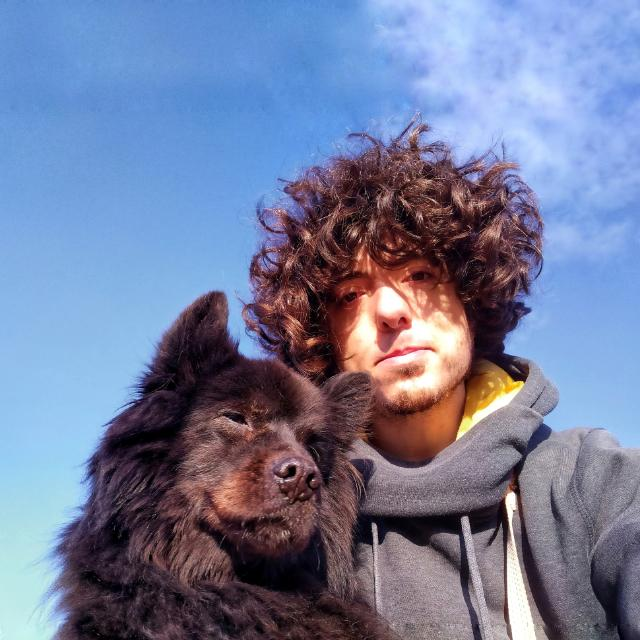

+++
title = 'Carpeta'
date = '2025-05-11T01:14:57+02:00'
description = "mmmm"
lastmod = '2025-05-11T01:14:57+02:00'
# draft = true # if true (or not set), the page will be excluded in build
private = false # If true, the article wont be listed and will only be visible by knowing its url
tags = ["vara"]
# # -------- DISPLAY OPTIONS --------
# show_breadcrumbs = false
# show_author = false
# show_date = false
# show_reading_time = false
# show_tags = false
show_table_of_contents = true
show_right_bar = true
# show_next_and_previous_arrows = false # If false (or not set), will hide the left/right arrows next to the articles' title for navigating between articles
# show_related_articles = false # If false, it wont show the related articles at the bottom. If true (or non set), they will show.
# article_cover = 'carpeta.png' # local path for the image used as the cover. NOTE: Check its extension! (.png set as a template)
# NOTE Since this is a leaf bundle (page in its own folder), placing an image in the same folder with the name 'cover' (no matter its extension) will be used as the cover AUTOMATICALLY. BUT if 'article_cover' is set, it will use that (this is also useful for having different covers for each language, if that is needed).
# # ------- FEATURE OPTIONS --------
featured = true # if true, the article will be featured in the index page.
# featured_title = 'Carpeta' # if set, it will use this as the title in the featured card. If not, it will use the article's title.
# featured_description = "" # if set, the article will use this description in the featured card. If not, it will use the article's description.
# featured_tags = [""] # if set, it will only feature the tags in this array (useful to display only some of the tags). Note: Tags must match the tag in .Params.tags

+++

joder...





## Pues holaaa

comienza la fantasiaaaa





## Pues holaaa

comienza la fantasiaaaa

