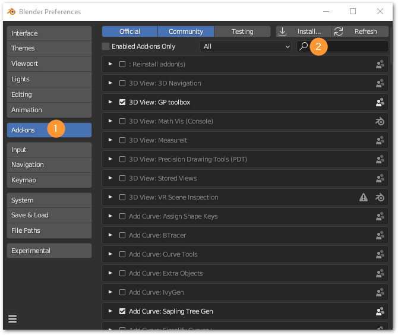
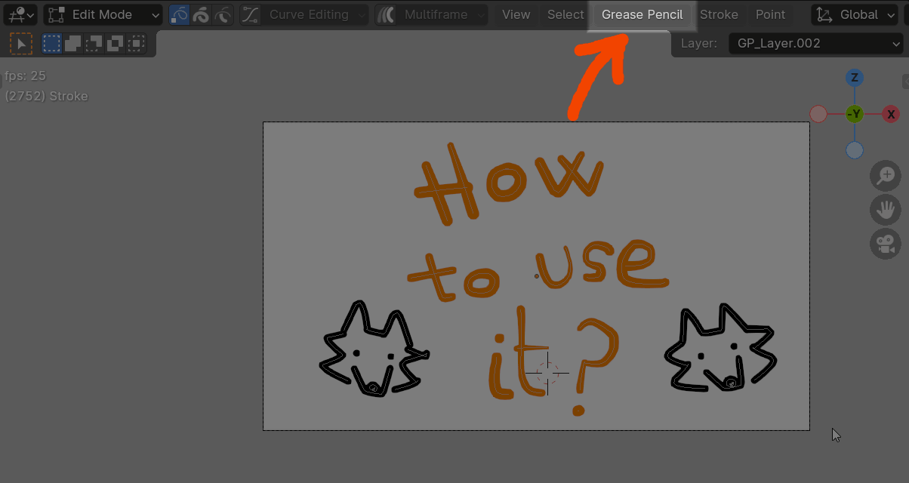
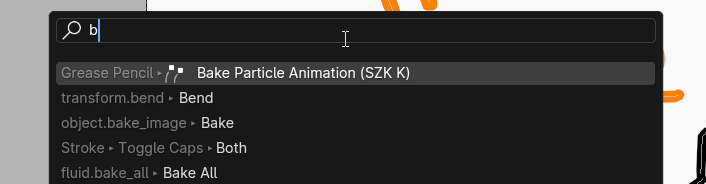
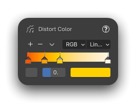
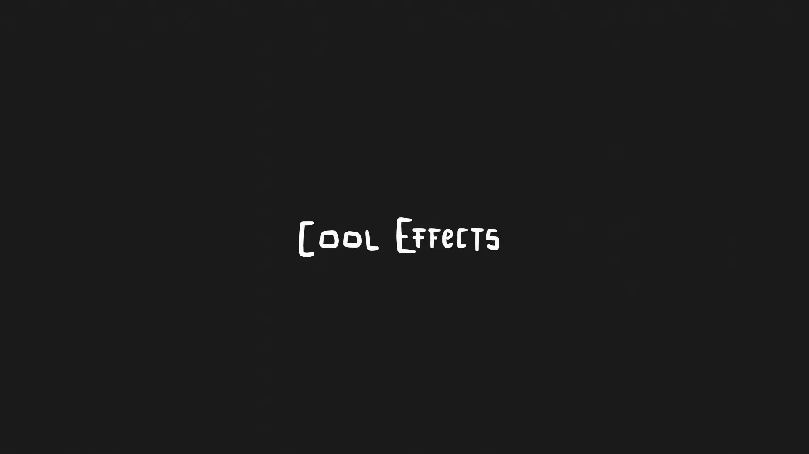
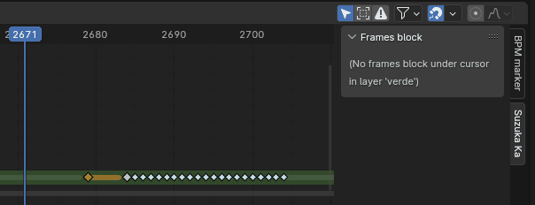

+++
title = 'Grease Pencil Particles'
date = '2025-09-06T18:17:30+02:00'
description = ""
lastmod = '2025-09-06T18:17:30+02:00'
# draft = true # if true (or not set), the page will be excluded in build
private = false # If true, the article wont be listed and will only be visible by knowing its url
# keywords = ["SZK", "Suzuka", "Suzuka Ka", "SuzukaKDev"] # custom keywords for the page
# tags = [""]
# main_classes = 'pixel-font' # classes for <main> element. Allows customization of each page. Example of use: add a class from `fonts.scss` to change the page font. (consolas-font, handwritten-font, etc).

# # -------- DISPLAY OPTIONS --------
# accent_color = "#ff168a" # customize the color for links, etc in the page
# feature_image_background_color = "#ff168a" # If the featured_image has transparency, change this color for customizing the background color (default: transparent)
# show_breadcrumbs = false
# show_description = false
# show_author = false
# show_date = false
# show_reading_time = false
# show_tags = false
show_table_of_contents = true
show_right_bar = true
# custom_pfp = "my-custom-pfp.png" # if set the article will use a custom image (NOT: You can also add the word 'pfp' to an image to automatically use it as the article's profile picture (pfp))
# pfp_css_classes = "half-border-radius" # Custom css class for the pfp image
# custom_profile_description = "Custom profile description" # Adds a custom profile description (below the pfp) for the page.
# show_next_and_previous_arrows = false # If false (or not set), will hide the left/right arrows next to the articles' title for navigating between articles
# show_related_articles = false # If false, it wont show the related articles at the bottom. If true (or non set), they will show.
# featured_image = 'grease-pencil-particles.png' # local path for the image used as the cover. NOTE: Check its extension! (.png set as a template)
# NOTE Since this is a leaf bundle (page in its own folder), placing an image in the same folder with the name 'cover' (no matter its extension) will be used as the cover AUTOMATICALLY. BUT if 'featured_image' is set, it will use that (this is also useful for having different covers for each language, if that is needed).
emoji = "✨"

# # ------- FEATURE OPTIONS --------
# featured = true # if true, the article will be featured in the index page.
# featured_title = 'Grease Pencil Particles' # if set, it will use this as the title in the featured card. If not, it will use the article's title.
# featured_description = "" # if set, the article will use this description in the featured card. If not, it will use the article's description.
# featured_tags = [""] # if set, it will only feature the tags in this array (useful to display only some of the tags). Note: Tags must match the tag in .Params.tags
# related_pages = [""] # If set, these pages (up to 3) will be displayed in the related section for this page. Useful when you want to be sure that a page appears as related

# # ------- SORT OPTIONS --------
# weight = 1
# NOTE: sort_by and sort_order is for "branch bundles" (or 'Directories' (folders with an _index.md containing other articles)), to determine how it sorts its articles
# sort_by = "Params.weight" # Options: "Params.weight", "Date" (Default), "Title", "Lastmod"
# sort_order = "asc" # Options: "desc", "asc" (descendant, ascendant (Default: "desc"))
+++

<!-- # 🚧 Página EN PROGRESO 🚧 -->

<!-- 

Página no traducida (de momento). Para leer el artículo, [visita la página en inglés 🇬🇧]({}).
 -->



<!-- # 🚧 This page is IN PROGRESS 🚧 -->

<!-- [Original Manual](https://www.notion.so/suzukak/Grease-Pencil-Particles-Suzuka-Ka-0336b6ee6e034f8cab74c4e45c86bce9#7d70c3b4e66c43049d6eb0b2122a0a30) -->

<!-- Page not translated (at the moment). For reading the article, [visit the spanish version 🇪🇸]({}). -->

## Grease Pencil Particles ✏✨ | Suzuka Ka

<!-- > This addon creates a **hand drawn particle animation from a Grease Pencil drawing**, allowing to create  -->
<!-- It automatically animates every stroke of a drawing and offers lots of possibilities to make lots of cool and weird things! -->

> Este *addon* transforma un dibujo hecho con Grease Pencil en una especie de sistema de partículas, y anima automáticamente cada partícula/trazo del dibujo.
Permite crear muchos !


Funciona con **Grease Pencil 3.0** ! 🥳


<!-- # Index 📋 -->

## Instalación 💻



1. Descarga el archivo *.zip* con el *addon*.
2. En Blender, ve a `Edit → Preferences`. Una vez ahí, pressiona la pestaña `Add-ons` y pulsa el botón `Install` de la esquina superior derecha:

1. Selecciona el archivo *.zip*.
2. Una vez instalado, busca `Grease Pencil Particles` en la barra de búsqueda y habilita el *addon*.


## Ejecutar el operador

Para ejecutar el operador que transforma el dibujo en partículas: 

<u>**Opción 1**</u>
- Estando en el modo `Edit Mode`, ve al menú `Grease Pencil` y selecciona `Bake particle Animation (SZK K)`:
	
	
	
<u>**Opción 2**</u>
- Estando en el modo `Edit Mode` o `Weight Paint Mode`, ve al panel de propiedades (por defecto se activa con la tecla ), y en la pestaña `Grease Pencil`, en el panel `SZK Bake Particles FX`, presiona el botón `Bake Particles`:
	
	

<u>**Opción 3**</u>
- Puedes buscar el operador en el menú de búsqueda 🔍 ( o ) por defecto), y busca `Bake Particle Animation (SZK K)`.
	
	


El operador funciona en el modo `Edit Mode` y `Weight Paint`. No está visible en otros contextos.


## Propiedades del operador

### Opciones básicas

1. `Presets` - Permite guardar (➕) y borrar (➖) una serie de propiedades pre-establecidas, para poder volver a usarlas en el futuro.
2. `Frames` (Fotogramas) - El número total de fotogramas que durará la animación. Pulsa el icono del *keyframe* si quieres cambiar el tipo de *keyframe* que se usará en el *dopesheet*.
3. `Seed` (Semilla) - La semilla se usa para variar el resultado de las operaciones aleatorias. Cambia la semilla para obtener resultados distintos manteniendo las mismas propiedades.
4. `Fragment strokes` (Fragmentar los trazos) - Elige si los trazos del dibujo se fragmentarán o no.
	- **No fragmentation** (Sin fragmentación) - Los trazos **no** se fragmentarán.
	- **By Points** (Por puntos) - Los trazos se fragmentarán a partir de un mínimo y máximo puntos establecidos por trazo.
	- **By Distance** (Por distancia) - Los trazos se fragmentarán a partir de una distancia mínima y máxima.
	- **By Vertex Group** - Los trazos se fragmentarán en función del *vertex group* seleccionado. La variacón en el peso que supere cierto umbral establecido fragmentará o no el trazo. Es útil para decidir exactamente por donde quieres "cortar".
5. `FX Type` (Tipo de Efecto) - Determina el algoritmo que se usa para determinar el momento en el que el trazo/la partícula comienza a ser afectada por el efecto y comienza a animarse.
	- **Explosion Radius** (Radio de explosión) - Todos los trazos dentro del radio de la explosión se verán afectados. Permite que dicho radio crezca con el tiempo, para crear una especie de honda expansiva.
	- **Build** - Los trazos se verán afectados en función del orden en el que hayan sido dibujados.
	- **Vertex Group** - Los trazos se verán afectados en función de su peso en un *vertex group*.
	- **Distance to point** (Distancia a un punto) - Los trazos comenzarán a animarse en función de lo cerca (o lejos) que estén de un punto.
	- **Random** (Aleatorio) - Los trazos comenzarán a animarse de forma aleatoria.
	- **X Position** - Los trazos comenzarán a animarse en función de su posición en el eje X.
	- **Y Position** - Los trazos comenzarán a animarse en función de su posición en el eje Y.
	- **Z Position** - Los trazos comenzarán a animarse en función de su posición en el eje Z.
	

**Consejo**: Usa el botón `↔` para **invertir el efecto**.

	
6. `FX Frames` - El número total de fotogramas que dura el efecto.
	- `Rand` - Aleatoriza el momento en el que los trazos comienzan a verse afectados por la simulación de partículas.
7. `Anchor Position` - Inicializa el punto de pivote en el que las particulas se veran desplazadas (o atraidas).
8. `Anchor position offset` - Permite ajustar la posición.
	
	
Usa el botón ♻ para resetear el offset a (0, 0, 0)
	

9. `Force` - La fuerza aplicada a cada trazo/partícula.
	1. `Random` - Aleatoriza la fuerza.
10. `Mass influence` (Influencia de la masa) - Cuanto mayor sea, más afectará la masa de los trazos/partículas a su movimiento.
	

**Nota:** El peso de una partícula/trazo se determina en función de su tamaño y ancho.


	
11. `Max Scatter` (Dispersión máxima) - Establece la variación máxima en el vector inicial del movimiento de la partícula/trazo.

#### Gravedad & Tamaño

1. `Vector de gravedad` - La **dirección** de la gravedad que afecta a las partículas.
2. `Rotación` - La velocidad máxima de rotación para cada partícula/trazo.
3. `Turbulencia` - Varía el centro de rotación sobre el que se rota una partícula, creando una especie de movimiento de espiral y un movimiento más caótico.
	1. `Randomness` - Aleatoriza la turbulencia.
4. `Algoritmo para calcular el tamaño` - Establece qué algoritmo se usa para samplear la curva que determina el tamaño ([en el panel de propiedades](#panel-de-propiedades)).
	1. `Lifetime` - La curva del tamaño se sampleará una única vez, durante el ciclo de vida de cada partícula (desde que comienza a animarse, hasta el fotograma final). Las partículas que comiencen a animarse antes, samplearán la curva más lento que las partículas con un menor tiempo de vida.
	2. `Speed` (Velocidad) - La curva del tamaño se sampleará a una velocidad constante, para todas las partículas. Y si se llega al final, comenzará de nuevo, en bucle.
		1. `Randomness` - El nivel de aleatoriedad para la velocidad en que cada partícula samplea la curva con el tamaño.

### Efectos

#### Noise (Ruido)

Añade movimiento aleatorio a las partículas/trazos.

1. `Noise type` - El tipo de ruido usado.
2. `Seed` - La semilla usada en la generación. Cambiala para obtener resultados diferent.
3. `Strength` (Fuerza) - La fuerza del ruido.
4. `Mass influence` (Influencia de la masa) - Determina el grado en que el peso de una partícula/trazo afectará al movimiento aleatorio. Para volres altos, las partículas más ligeras se moverán más fácilmente con el ruido.
	

Usa el botón `↔` para invertir el efecto (las partículas más pesadas serán las más afectadas por el ruido).


5. `Frequency` (Frecuencia) - La frecuencia del ruido. Usa valores bajos para un movimiento más suave.

1. `Dissonance` (Disonancia) - Determina qué tan distinto es el ruido para todas las partículas. Para valores en torno a 0, todas las partículas se moveran en armonía (similar al movimiento de una bandada de estorninos):

	
	Valores más altos crearán un movimiento más caótico.
	

1. `Fijar eje` - Al fijar un eje, el ruido en el eje seleccionado no tendrá efecto.

#### Distort Strokes (Distorsionar trazos)

Aplica un efecto de distorsión cuando los trazos comienzan a animarse.

1. `Intensity` (Intensidad) - La intensidad/fuerza de la distorsión.
	1. `Randomness` - Aleatoriza el efecto para cada trazo.
2. `Frequency` (Frecuencia) - La frecuencia del ruido usado para el efecto de distorsión. Valores altos producen unas distorsiones más "puntiagudas", mientras que valores bajos, distorsiones más suaves.
	1. `Frame variation` - Determina cúanto varía el ruido en cada frame.
3. `Frames` - La duración (en frames) del efecto de distorsión.
	1. `Randomness` - Aleatoriza la duración del efecto para cada trazo.
4. `Use Color` (usar color) - Si está activado, sampleará los colores de la rampa del [panel de propiedades](#panel-de-propiedades):
	
	
	
5. `Blend mode` (Modo de fusión) - Selecciona el modo de fusión usado para mezclar los colores de la rampa con el color original de cada trazo.

#### Fade Strokes (Desvanecer trazos)

Desvanece los trazos con el tiempo.

1. `Tipo de desvanecimiento` - Elige el método utilizado para desvanecer los trazos. Hay 2 tipos:
	<!-- 1. `Stroke thickness` - Changes the strokes thickness during the fade effect. Is the fastest method in terms of computing. -->
	<!-- 2. `Points opacity` - Changes the opacity of every point in the stroke. Is slower in terms of computing since iterates each point for each stroke. -->
	a. **Stroke thickness** (Grosor del trazo) - Va reduciendo el grosor del trazo hasta hacerlos desaparecer.

	b. **Points opacity** (Opacidad de los puntos) - Cambia la opacidad de cada punto del trazo para desvanecerlos.
2. `Algoritmo de desvanecimiento` - Selecciona el algoritmo usado para desvanecer los trazos. Hay 2 tipos:`Proporcional` and `Constante`.
	<!-- a. **Proportional** will fade each stroke proportionally to their life time.
	b. **Constant** the strokes will fade at a constant rate. -->

##### Desvanecimiento Proporcional

Los trazos/partículas se desvanecerán proporcionalmente a su tiempo de vida (el tiempo que estén animándose, desde que comienzna a moverse hasta el final).

Garantiza que todas las partículas han sido desvanecidas al final del efecto.

1. `Start` (Inicio) - Porcentaje respecto a la vida de cada trazo en el que el trazo **comienza** a desvanecerse.
	1. `End` (Final) - Porcentaje respecto a la vida de cada trazo en el que el trazo **termina** de desvanecerse.
2. `Randomness` - Aleatoriza los porcentajes de inicio/final de cada trazo.

##### Desvanecimiento Constante

El efecto de desvanecimiento usará un número constante de frames y todos los trazos se desvanecerán a un ritmo cosntante.

1. `Start` (Inicio) - El número de frames que han de pasar para cada partícula desde que ha comenzado a moverse para que comience a desvanecerse.
2. `Fade` (Desvanecimiento) - El total de frames que dura el desvanecimiento.
3. `Randomness` - Aleatoriza los valores previos para cada trazo/partícula.

<!-- > In this animation, the bomb’s fuse was animated with a `Constant` fading, to ignore the particle’s lifetime and achieve a constant fade for each particle. While the rest of the drawing used a `Proportional` fade (randomized). -->
> Ejemplo práctico: En esta animación, la mecha de la bomba fue animada con un desvanecimiento `Constante`, para ignorar el tiempo de vida de la partícula y que todas las partículas se desvanecieran a un ritmo similar.
> 
> 
> 

#### Color 🎨

¡Añade color a los trazos/partículas!

1. `Blend mode` (Modo de fusión) - Elige el modo de fusión usado para mezclar el color seleccionado con el color original de cada trazo.
2. `Color algorithm` (Algoritmo) - Elige el método usado para aplicar color a las partículas. Hay 2 opciones:
	
	a. **Random** (Aleatorio) - Elige un color aleatorio de la rampa de colores.
	
	b. **Variable** - El color varia sampleando los colores de la rampa de colores.

3. `Delay frames` (Frames de retraso) - El tiempo en el que cada partícula se retrasa hasta cambiar su color.
4. `Fade frames` (Frames de desvanecimiento) - El número total de frames en el que ambos colores se mezclan, para crear variaciones más suaves.

##### Algoritmo de Color variable

1. `Speed` (Velocidad) - La velocidad a la que cada partícula sampleara el color de la rampa de colores.
	
	a. `Speed randomness` (Velocidad aleatoria) - El nivel de aleatoriedad para la velocidad en cada trazo/partícula.
2. `Randomness` - Aleatoriza el punto inicial en el que comienza a samplear la rampa de colores cada trazo/partícula.

#### Depth Color (Color de profundidad)

Tiñe las partículas de un color en función de su distancia a la cámara activa. Util para crear una especie de profundidad atmosférica que ayuda a distinguir las partículas más cercanas de las más lejanas.

1. `Distance` (Distancia) - La distancia mínima y máxima. Las partículas cercanas al valor mínimo samplearan colores más a la izqueirda de la rampade color situada en el [panel de propiedades](#panel-de-propiedades), mientras que las partículas más alejadas samplearán colores más cercanos a la parte derecha de la rampa.
	
	

Puedes encontrar la rampa con la profundiad de color en el panel de propiedades, en la pestaña `Grease Pencil` (ver [panel de propiedades](#panel-de-propiedades))


	
2. `Blend frames` - The total time it takes to blend the strokes/particles to the depth color, to avoid abrupt changes.

### Extra Debris (Fragmentos Extra)

<!-- Adds extra particles/strokes to the drawing randomly. Because the more debris, the better. -->
Añade más partículas/trazos al dibujo. 

1. `Fragmentos extra` - El número total de fragmentos extra añadidos.
2. `Tamaño de los fragments` - El tamaño de los nuevos fragmentos añadidos será elegido al azar entre un mínimo y máximo de puntos por fragmento/partícula.
3. `Proportional distribution` (Distribución proporcional) - Si está activado, cuanto mayor sea el trazo, más probabilidad habrá de que se instancien nuevas partículas/fragmentos en su posición.
4. `Random width` (Ancho aleatorio) - El nivel de aleatoriedad entre los fragmentos añadidos. Si se pone a 0, los nuevos fragmentos tendrán el mismo tamaño que los trazos en donde se instancian.

### Opciones Varias

1. `Resolution` (Resolución) - Simplifica (cuando es un número negativo) o subdivide en más puntos (cuando el número es positivo) los trazos del dibujo.
Es útil cuando quieres reducir la complejidad del dibujo para ejecutar el operador más rápidamente, o para cuando quieres incrementar la calidad de los trazos (a coste de más tiempo de cálculo y memoria).

	
Puedes ver un recuento total de los puntos del dibujo al lado de la resolución.


Personalmente recomiendo usar una baja resolución mientras estás editando las propiedades para una mayor velocidad de cálculo (**los dibujos muy grandes puede requerir mayor tiempo de procesado**), y una vez se ve como deseas, puedes incrementarla si así lo deseas.



	
	
2. `Offset` (desplazamiento) - Desplaza toda la animación X frames.
3. `Preview` - Permite cambiar el frame incial en el que comienza la preview del efecto.
4. `Loop` (Bucle) - Sí está activado, se añadirá un bucle temporal para previsualizar más fácilmente la animación.
5. `Time Scale` (Escala del tiempo) - Multiplica la escala del tiempo. Util para acelerar o ralentizar la animación.
	
	
Valores negativos hace que vaya atrás en el tiempo.
	
	
6. `Frames gap` (Intervalo de frames) - El intervalo total (en frames) entre cada keyframe de la animación. Es útil para cuando quieras lograr una animación a menos frames por segundo (en plan *stop motion*, por ejemplo).
7. `Usar Máscara` - Si está activado, permite elegir un vertex group en el Grease Pencil para "filtrar" qué partes del dibujo reaccionan a la animación y qué partes no.
8. `Vertex group` - El *vertex group* que se usará como máscara (en caso de estar ésta activada).
<!-- TODO arreglar -->
9. `Treshold` (Umbral de la Máscara) - Los pesos por encima de dicho umbral en el *vertex group* seleccionado serán incluidos en la máscara y no se verán afectados por la animación.
 <!-- Weight values in the mask vertex group above/below the treshold will be included/excluded from the mask and won’t be affected by the effect. -->
10. `Bypass` - Si está activado, el operador no será procesado.
	
Esto es útil para cuando tengas que hacer muchos cambios en las propiedades. De esta forma, el operador no se ejecutará y podrás modificar todo con suavidad, sin que haya ningún parón.
	

	<!-- > ***Why is that helpful?*** -->
	<!-- Since the operator can be hard to process depending the drawing complexity, there would be some times when you would like to edit different values without triggering the operator’s execution. In those cases, is better to press bypass, make your changes, and then disable bypass, to avoid waiting between each change. -->

## Panel de Propiedades

Hay algunos parametros más avanzados (como curvas, rampas de color, etc.) que no pueden ser mostrados en el panel del operador debido a algunas limitaciones de Blender.

<!-- The addon uses some more complex properties that Blender doesn’t allow to be displayed in the Operator’s panel, like curves and color ramps. -->

<!-- They are located in the *N Panel* (Properties Panel), under the Grease Pencil tab: -->

Dichos parámetros se encuentran en el panel derecho que aparece al pulsa  en el viewport, en la pestaña *Grease Pencil*:

<!-- Here you can find some properties that are related to each section in the Operator’s panel. -->

Aquí podrás encontrar algunas *color ramps*, curvas, etc.

Worth mention the Time Scale curve:

<!--  -->




Permite variar la escala del tiempo, ralentizarlo, acelerarlo, etc.
<!-- It allows to alter the Time Scale along the effect, creating cool changes in the pace that looks awesome! -->

> En esta animación, la escala del tiempo comienza siendo lenta al principio, y posteriormente acelera:
> 
> 

<!-- > In this animation, the time scale curve was changed to slower it a bit after the start, and then accelerates again, creating some kind of time warp: -->


Si el panel del operador se está ejecutando y en pantalla, al editar alguna propiedad del panel de propiedades desaparecerá.

Para volver a ejecutar el operador con las mismas propiedades (y con las propiedades del panel modificadas), situa el cursor entre los márgenes de la animación anterior, y presiona el botón :

<!-- Important note ❗: If the Operator’s panel is showing, and you edit a property from the N Panel, after changing a property in the Operator’s panel, it will call *undo/redo* internally, and you will lose the changes you made.  -->

<!-- If you want to keep your changes in the curves/color ramps when the operator’s panel is being displayed, call `RE-EXECUTE`. -->
<!-- If you want to execute the operator again with the previous properties and with the new edited curves/color ramps from the N Panel, place the cursor above the range of the last baked particles, and press the button `RE-EXECUTE`: -->

<!-- TODO captura del botón RE-EXECUTE -->



## Otros Operadores ⚙

El *addon* añade algunos operadores que hace que sea más fácil trabajar con las animaciones en el *dopesheet*.

<!-- The addon adds as an extra some new handy operators for better working with animations. -->

### Remove frames block (Borrar bloque de frames)

Borra todos los frames de un mismo tipo que se encuentran en el mismo bloque:

<!-- It removes/selects a frame block with frames of the same keyframe type. -->

<!-- > I made it because I personally hated having to precisely choose with the mouse interpolated frames and such, so this makes it easier! -->
> Decidí añadirlo porque personalmente se me hacía tedioso tener que seleccionar precisamente con el ratón todos los frames. Esto lo hace más fácil.

### Select frames block (Seleccionar bloque de frames)

Selecciona un bloque de frames del mismo tipo, sin borrarlo.


Puedes encontrar ambos en el menu del *dopesheet*, dentro de la pestaña ***Suzuka Ka***.


## Preguntas frecuentes ❔

<!-- - ***Why do you write a FAQ section if no one -absolutely no one- has asked you a single question related the add-on?***
	
	Thats a very good question, and I’m glad that you asked it. I don’t know. I guess that if I ever got asked about something “frequently” (more than 2 times), I’ll clarify it here in case it’s useful for others 🐢.

  -->

<!-- - ***When I move the cursor beyond a certain point, it goes back! Why?*** -->
- ***Cuando muevo el cursor en el dopesheet, vuelve a un punto anterior de la animación?***
	
	Esto se debe a que se ha quedado ejecutando el bucle que repite la preview de la animación.
	Dicho bucle se mantiene en memoria mientras que el último operador ejecutado sea el de crear la animación de partículas. Por lo que ejecutar un nuevo operador lo borrará. 
	Por ejemplo, **presionar**  para cmbiar el modo debería ser bastante para borrarlo.

	Si quieres borrarlo manualmente, puedes ir al **panel de propiedades" y presionar el botón ;

	<!-- I made *hacky* loop while executing the operator to easily preview the particle animation. It should be removed when executing a new operator (for example, **pressing**  to switch the mode should be enough).  -->
	
	<!-- If you want to delete it manually, you can go to the ***N panel*** and under the addon panel, and press **Disable Loop:** -->
	

### Limitaciones

Los trazos con materiales de relleno no están soportados en la versión actual, solo los trazos normales.
<!-- Strokes with fill materials are not supported at the moment in the current version, only normal non-filled strokes. -->



Las diferentes opciones relacionadas con los *Vertex Groups* solo funcionan en la versión *Legacy* del addon (previa al Grease Pencil 3.0)
<!-- Options related Vertex Groups only work in the Grease Pencil Legacy version. -->


Los métodos para acceder a los pesos de los *Vertex Group* en los puntos de un dibujo de Grease Pencil han sido **eliminados** en Grease Pencil 3.0, y la nueva forma de acceder a dichos pesos, de momento **está rota/*buggeada*** 🐛 y no funciona.



 

Cuando Blender arregle el bug, lo arreglaré 👍.



## Créditos ©

<!-- The required attribution to some icons used: -->
Atribución necesaria para algunos iconos usados:

- [Aleatorio iconos creados por Freepik - Flaticon](https://www.flaticon.es/iconos-gratis/aleatorio)

- [Explosión iconos creados por Freepik - Flaticon](https://www.flaticon.es/iconos-gratis/explosion)

- [Repetir iconos creados por Jagat Icon - Flaticon](https://www.flaticon.es/iconos-gratis/repetir)

- [Customize icons created by Smashicons - Flaticon](https://www.flaticon.com/free-icons/customize)

- [Blend icons created by Mohamed Mbarki - Flaticon](https://www.flaticon.com/free-icons/blend)

- [Random icons created by Buandesign - Flaticon](https://www.flaticon.com/free-icons/random)

- [Random icons created by Grand Iconic - Flaticon](https://www.flaticon.com/free-icons/random)

- [Color icons created by Nikita Golubev - Flaticon](https://www.flaticon.com/free-icons/color)

<!-- [Aleatorio iconos creados por Freepik - Flaticon](https://www.flaticon.es/iconos-gratis/aleatorio), [Explosión iconos creados por Freepik - Flaticon](https://www.flaticon.es/iconos-gratis/explosion), [Repetir iconos creados por Jagat Icon - Flaticon](https://www.flaticon.es/iconos-gratis/repetir), [Customize icons created by Smashicons - Flaticon](https://www.flaticon.com/free-icons/customize), [Blend icons created by Mohamed Mbarki - Flaticon](https://www.flaticon.com/free-icons/blend), [Random icons created by Buandesign - Flaticon](https://www.flaticon.com/free-icons/random), [Random icons created by Grand Iconic - Flaticon](https://www.flaticon.com/free-icons/random), [Color icons created by Nikita Golubev - Flaticon](https://www.flaticon.com/free-icons/color) -->

<!-- - Borrar
	
	<a href="[https://www.flaticon.es/iconos-gratis/aleatorio](https://www.flaticon.es/iconos-gratis/aleatorio)" title="aleatorio iconos">Aleatorio iconos creados por Freepik - Flaticon</a>
	
	<a href="[https://www.flaticon.es/iconos-gratis/explosion](https://www.flaticon.es/iconos-gratis/explosion)" title="explosión iconos">Explosión iconos creados por Freepik - Flaticon</a>
	
	<a href="[https://www.flaticon.es/iconos-gratis/repetir](https://www.flaticon.es/iconos-gratis/repetir)" title="repetir iconos">Repetir iconos creados por Jagat Icon - Flaticon</a>
	
	<a href="[https://www.flaticon.com/free-icons/customize](https://www.flaticon.com/free-icons/customize)" title="customize icons">Customize icons created by Smashicons - Flaticon</a>
	
	<a href="[https://www.flaticon.com/free-icons/blend](https://www.flaticon.com/free-icons/blend)" title="blend icons">Blend icons created by Mohamed Mbarki - Flaticon</a>
	
	<a href="[https://www.flaticon.com/free-icons/random](https://www.flaticon.com/free-icons/random)" title="random icons">Random icons created by Buandesign - Flaticon</a>
	
	<a href="[https://www.flaticon.com/free-icons/random](https://www.flaticon.com/free-icons/random)" title="random icons">Random icons created by Grand Iconic - Flaticon</a>
	
	<a href="[https://www.flaticon.com/free-icons/color](https://www.flaticon.com/free-icons/color)" title="color icons">Color icons created by Nikita Golubev - Flaticon</a>
	 -->

## Contacto 🐺✉

<!-- 🐦 Twitter: [@SuzukaKDev](https://twitter.com/SuzukaKDev)

✉ Mail: [suzukakadev@gmail.com](mailto:suzukakadev@gmail.com) -->
Puedes contactar conmigo vía:





---

<!-- Gumroad Page: [Grease Pencil to Particles | Suzuka Ka](https://orb91.gumroad.com/l/grease-pencil-particles) -->



