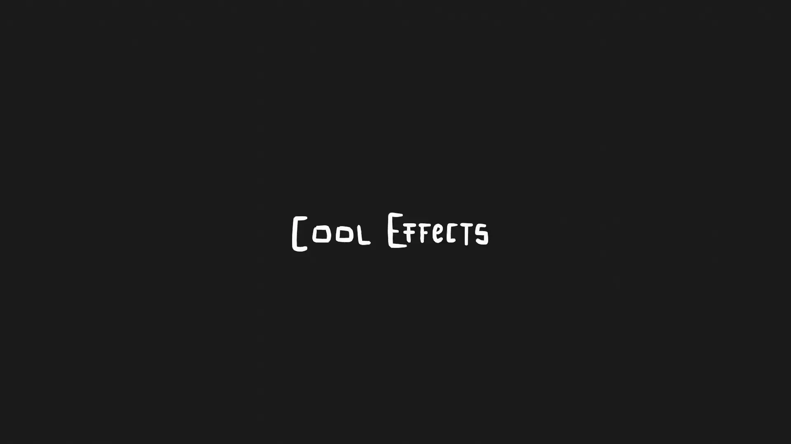

+++
title = 'Grease Pencil Particles'
date = '2025-09-06T18:17:30+02:00'
description = ""
lastmod = '2025-09-06T18:17:30+02:00'
# draft = true # if true (or not set), the page will be excluded in build
private = false # If true, the article wont be listed and will only be visible by knowing its url
keywords = ["SZK", "Suzuka", "Suzuka Ka", "SuzukaKDev", "Blender", "Blender Addon", "Addon", "Illustration", "Animation"] # custom keywords for the page
tags = ["Blender", "Blender Addon", "Animation"] # custom keywords for the page
# tags = [""]
# main_classes = 'pixel-font' # classes for <main> element. Allows customization of each page. Example of use: add a class from `fonts.scss` to change the page font. (consolas-font, handwritten-font, etc).

# # -------- DISPLAY OPTIONS --------
# accent_color = "#ff168a" # customize the color for links, etc in the page
# feature_image_background_color = "#ff168a" # If the featured_image has transparency, change this color for customizing the background color (default: transparent)
# show_breadcrumbs = false
# show_description = false
# show_author = false
# show_date = false
# show_reading_time = false
# show_tags = false
show_table_of_contents = true
show_right_bar = true
# custom_pfp = "my-custom-pfp.png" # if set the article will use a custom image (NOT: You can also add the word 'pfp' to an image to automatically use it as the article's profile picture (pfp))
# pfp_css_classes = "half-border-radius" # Custom css class for the pfp image
# custom_profile_description = "Custom profile description" # Adds a custom profile description (below the pfp) for the page.
# show_next_and_previous_arrows = false # If false (or not set), will hide the left/right arrows next to the articles' title for navigating between articles
# show_related_articles = false # If false, it wont show the related articles at the bottom. If true (or non set), they will show.
# featured_image = 'grease-pencil-particles.png' # local path for the image used as the cover. NOTE: Check its extension! (.png set as a template)
# NOTE Since this is a leaf bundle (page in its own folder), placing an image in the same folder with the name 'cover' (no matter its extension) will be used as the cover AUTOMATICALLY. BUT if 'featured_image' is set, it will use that (this is also useful for having different covers for each language, if that is needed).
emoji="✨"

# # ------- FEATURE OPTIONS --------
# featured = true # if true, the article will be featured in the index page.
# featured_title = 'Grease Pencil Particles' # if set, it will use this as the title in the featured card. If not, it will use the article's title.
# featured_description = "" # if set, the article will use this description in the featured card. If not, it will use the article's description.
# featured_tags = [""] # if set, it will only feature the tags in this array (useful to display only some of the tags). Note: Tags must match the tag in .Params.tags
# related_pages = [""] # If set, these pages (up to 3) will be displayed in the related section for this page. Useful when you want to be sure that a page appears as related

# # ------- SORT OPTIONS --------
# weight = 1
# NOTE: sort_by and sort_order is for "branch bundles" (or 'Directories' (folders with an _index.md containing other articles)), to determine how it sorts its articles
# sort_by = "Params.weight" # Options: "Params.weight", "Date" (Default), "Title", "Lastmod"
# sort_order = "asc" # Options: "desc", "asc" (descendant, ascendant (Default: "desc"))
+++



<!-- # 🚧 This page is IN PROGRESS 🚧 -->

<!-- [Original Manual](https://www.notion.so/suzukak/Grease-Pencil-Particles-Suzuka-Ka-0336b6ee6e034f8cab74c4e45c86bce9#7d70c3b4e66c43049d6eb0b2122a0a30) -->

<!-- Page not translated (at the moment). For reading the article, [visit the spanish version 🇪🇸]({}). -->

# Grease Pencil Particles ✏✨ | Suzuka Ka

> This addon creates a **hand drawn particle animation from a Grease Pencil drawing**, allowing to create 
It automatically animates every stroke of a drawing and offers lots of possibilities to make lots of cool and weird things!


Supports **Grease Pencil 3.0**  of Grease Pencil! 🥳


<!-- # Index 📋 -->

# Installation 💻



1. Download the *.zip* file containing the addon and place it wherever you like.
2. In Blender, go to `Edit → Preferences`. Once there, press the `Add-ons` tab and press `Install` button on the top-right corner:

1. Select the *.zip* file.
2. Once installed, search for `Grease Pencil Particles` in the search bar, and enable the addon.


# Executing the operator

To execute the operator: 

- While being in `Edit Mode`, go to `Grease Pencil` menu, and there select `Bake particle Animation (SZK K)`:
	
	
	
- (Or) In `Edit Mode` or `Weight Paint Mode`, go to the `N` (properties) panel and under the panel `SZK Bake Particles FX` in the `Grease Pencil` tab, and press `Bake Particles`:
	
	
	
- You can also search the operator in the Search Pop-up menu 🔍 (`F3`(or `space`) by default), and look for `Bake Particle Animation (SZK K)`.
	
	
	


💡 The operator works in `Edit Mode` and in `Weight Paint` mode. Is not visible in other contexts.


# Operator’s Properties

## Basic options

1. `Operator Presets` - Allows to save (➕) and delete (➖) a set of properties that you liked to use it in the future.
2. `Frames` - The total frames for the animation. Press the keyframe icon to change the keyframe type used in the dopesheet.
3. `Seed` - The seed used for the random generation. Change it to achieve different results while keeping the same properties.
4. `Fragment strokes` - Choose if the strokes will be fragmented into pieces or not.
	- **No fragmentation** - The strokes will not be fragmented.
	- **By Points** - The strokes will be fragmented by a random value between min points and max points.
	- **By Distance** - The strokes will be fragmented by its total distance determined by a random value between min and max distance.
	- **By Vertex Group** - The strokes will be fragmented depending a selected vertex group (weight variations above a treshold will determine where to fragment the stroke).
5. `FX Type` - Determines the algorithm used to determine the starting point where a stroke/fragment is affected by the FX.
	- **Explosion Radius** - Simulates an explosion. All strokes inside the explosion’s radius will be affected. It gives the option to increase the radius over time.
	- **Build** - The strokes will be affected depending their drawing order.
	- **Vertex Group** - The strokes will by affected depending its weight in a vertex group.
	- **Distance to point** - The strokes will be affected depending how closer (or far) they are to a poing.
	- **Random** - The strokes will be affected randomly.
	- **X Position** - The strokes will be affected according their X position.
	- **Y Position** - The strokes will be affected according their Y position.
	- **Z Position** - The strokes will be affected according their Z position.
	

**Tip**: Use the `↔`  button to **reverse the effect**.

	
6. `FX Frames` - The total frames it takes the effect to affect all strokes.
	- `Rand` - Randomizes the time on which the strokes starts to being affected by the particle simulation.
7. `Anchor Position` - Initializes the pivot point where the particles are dragged in or out.
8. `Anchor position offset` - Offsets the pivot position.
	
Use ♻ to reset the offset to (0, 0, 0)
	
9. `Force` - The force applied to the strokes/particles when they are affected by the effect.
	1. `Random` - Adds randomness to the force applied to each stroke/particle.
10. `Mass influence` - The higher the level, the more the strokes/particles will be affected by their mass.
	

**Note:** The weight of a stroke/particle is determined by its size and width.


	
11. `Max Scatter` - The maximum random direction deviation in the vector 

### Gravity & Size over life

1. `Gravity vector` - The **direction** of the **gravity** that affects the particles.
2. `Rotation` - The maximum **rotation speed** for the strokes/particles.
3. `Turbulence` - **Offsets the rotation center** of each point to create some kind of “spiral effect” and more chaotic rotation.
	1. `Randomness` - Randomizes the turbulence for each stroke/particle.
4. `Size sampling algorithm` - Determines the algorithm used for sampling the Size over life curve ([in the properties panel](#properties-panel)).
	1. `Lifetime` - The size curve will be sampled once entirely during the stroke’s/particle’s lifetime. Older particles (with a sooner start) will sample it slower than “younger” particles (they will sample it faster since their life time will be shorter).
	2. `Speed` - The sample curve will be sample at a constant speed. If its exceeded, it will loop from the start.
		1. `Randomness` - The level of randomization in the speed for each stroke/particle.

## Effects

### Noise

Adds a **random movement** to the strokes/particles.

1. `Noise type` - The **type of noise** used.
2. `Seed` - The seed used for the noise. Change it to obtain different results while keeping all the properties.
3. `Strength` - The **strength** of the noise.
4. `Mass influence` - Determines how the stroke’s/particle’s weight affects the noise movement. For higher values, lighter values will be moved easier by the noise.
	

Use the `↔` icon to reverse the effect (heavier particles will be affected the most by the noise).


5. `Frequency` - The frequency in the movement for the noise. Use low values for a smoother movement.

1. `Dissonance` - Determines how similar is the noise along every particles. For values around 0, all particles will be move in harmony with a similar noise movement. Kinda in a **starlings kind of movement**:

	
	Higher values will produce a more chaotic effect.
	

1. `Lock Axis` - Locking an axis to **ignore the noise movement in that axis**.

### Distort Strokes

Applies a distortion effect right directly when the strokes starts to be affected.

1. `Intensity` - The intensity of the stroke’s distortion.
	1. `Randomness` - Randomizes the intensity for each stroke.
2. `Frequency` - The frequency of the noise used to distort the strokes. Use higher values for a more *spiky* effect. Use lower values for a more smoth distortion.
	1. `Frame variation` - Determines how much the noise changes for each frame. Set it to 0 to do not move the distortion effect along the frames.
3. `Frames` - The duration of the distortion.
	1. `Randomness` - Randomizes the duration for each stroke.
4. `Use Color` - If True, it will sample the colors from the ***Sidebar N panel*** during the distortion time*:*
	
	
	
5. `Blend mode` - The blending mode used to mix the distortion color with the original stroke’s color.

### Fade Strokes

Fades the strokes.

1. `Fade type` - Choose the algorithm used for the fading. There are 2 types:
	<!-- 1. `Stroke thickness` - Changes the strokes thickness during the fade effect. Is the fastest method in terms of computing. -->
	<!-- 2. `Points opacity` - Changes the opacity of every point in the stroke. Is slower in terms of computing since iterates each point for each stroke. -->
	a. **Stroke thickness** - Changes the strokes thickness during the fade effect.

	b. **Points opacity** - Changes the opacity of every point in the stroke. 
2. `Fade Algorithm` - The fading algorithm used when fading the strokes. 2 types: `Proportional` and `Constant`.
	<!-- a. **Proportional** will fade each stroke proportionally to their life time.
	b. **Constant** the strokes will fade at a constant rate. -->

#### Proportional Fade

The strokes/particles will be faded according their lifetime, ensuring that all particles will be faded at the end of the effect.

1. `Start` - Percentage of the stroke’s lifetime from which the stroke starts to fade.
	1. End - Percentage of the stroke’s lifetime on which the stroke’s fading has been comleted
2. `Randomness` - Randomizes the start and end percentages for each stroke.

#### Constant Fade

The fade effect will take a constant number of frames to achieve a similar fade pace for every particle.

1. `Start` - The delay it takes for a particle since it started to move to start the fade.
2. `Fade` - The total frames it takes the particle to fade away.
3. `Randomness` - Randomizes the start and fade frames for each particle.

> In this animation, the bomb’s fuse was animated with a `Constant` fading, to ignore the particle’s lifetime and achieve a constant fade for each particle. While the rest of the drawing used a `Proportional` fade (randomized).
> 
> 
> 
> 

### Color 🎨

Adds colours to the strokes/particles.

1. `Blend mode` - The blending mode algorithm for mixing the original stroke’s color with the new color.
2. `Color algorithm` - The algorithm used to tint the particles. It has 2 options:
	
	a. **Random** - It chooses a random color of the color ramp.
	
	b. **Variable** - The color varies according the color ramp.
3. `Delay frames` - The frames it takes before the strokes/particles changes the color after their start time.
4. `Fade frames` - The total frames it takes to fade the original stroke’s/particle’s color to the new color.

#### Color variable algorithm

1. `Speed` - The speed with which each particle samples the color of the color ramp.
	
	a. `Speed randomness` - The level of randomization in the speed for each stroke/particle.
2. `Randomness` - Randomizes the starting point in the color ramp.

<!-- TODO poner el otro algorithm??? -->

### Depth Color

Tints the particle according their distance to the active camera, creating some kind of depth and helping to distinguish near particles from far particles.

1. `Distance` - The minimum and maximum distance. Particles near to the minimum distance will sample a color from the left side of the color ramp in the ***Sidebar N Panel***, while particles near to the maximum distance will sample a color in the right side of the ramp.
	
	<!--  -->
	

You can locate the depth color ramp in the N Panel, under the Grease Pencil tab. (View [properties panel](#properties-panel))



	
2. `Blend frames` - El total de frames que se tarda para mezclar ambos colores. Util para evitar cambios bruscos.

## Extra Debris (Fragmentos extra)

Añade partículas/trazos extras. Porque cuantas más, mejor!

1. `Extra debris count` - The amount of total debris added.
2. `Debris size` - The size of the new debris will be randomly choose between the minimum and maximum points.
3. `Proportional distribution` - If True, the bigger strokes, the higher the chance to have more particles instanced in their position.
4. `Random width` - The level of the randomization for the debris width. If is set to 0, the new debris will have the same size of the stroke’s they are instanced into.

## Various Options

1. `Resolution` - Simplifies (or subdivides (if the value is positive)) the drawing. Useful when you want to reduce the points to execute the operator faster, or to increase the points to increase the quality.
	
You can see a counter of the total points next to it.

	
💡 I personally recommend having a low resolution while editing the values, and once you are sure that it looks as you want, increase the resolution if desired.
**Big drawings can take some time to process**.
	
	
	
	
2. `Offset` - Offsets the entire animation X frames.
3. `Preview` - Lets you decide the frame you want to preview first after editing a value.
4. `Loop` - If True, a temporary loop will be added just to loop the frames of the animation (to better see the changes you are making).
5. `Time Scale` - Multiplies the time scale, to accelerate or slow down the animation.
	
	<aside>
	💡 Tip: Set it to negative to achieve a reverse effect
	
	</aside>
	
6. `Frames gap` - The gap between each frame in the baked animation. Useful if you want to achieve some kind of step motion vibe or similar.
7. `Use mask` - If True, enables the option to use a vertex group as a mask to exlude some parts of the drawing from the particle effect.
8. `Vertex group` - The vertex group to be used as a mask.
9. `Mask Treshold` - Weight values in the mask vertex group above/below the treshold will be included/excluded from the mask and won’t be affected by the effect.
10. `Bypass` - If True, the operator won’t be processed.
	
	> ***Why is that helpful?***
	Since the operator can be hard to process depending the drawing complexity, there would be some times when you would like to edit different values without triggering the operator’s execution. In those cases, is better to press bypass, make your changes, and then disable bypass, to avoid waiting between each change.
	> 

# Properties Panel

The addon uses some more complex properties that Blender doesn’t allow to be displayed in the Operator’s panel, like curves and color ramps.

They are located in the *N Panel* (Properties Panel), under the Grease Pencil tab:

Here you can find some properties that are related to each section in the Operator’s panel.

Worth mention the Time Scale curve:

It allows to alter the Time Scale along the effect, creating cool changes in the pace that looks awesome!

> In this animation, the time scale curve was changed to slower it a bit after the start, and then accelerates again, creating some kind of time warp:
> 
> 
> 
> 


If the Operator’s panel is showing, and you edit a property from the N Panel, after changing a property in the Operator’s panel, it will call *undo/redo* internally, and you will lose the changes you made. 

<!-- If you want to keep your changes in the curves/color ramps when the operator’s panel is being displayed, call `RE-EXECUTE`. -->
If you want to execute the operator again with the previous properties and with the new edited curves/color ramps from the N Panel, place the cursor above the range of the last baked particles, and press the button `RE-EXECUTE`:

<!-- TODO captura del botón RE-EXECUTE -->



# Other operators ⚙

The addon adds as an extra some new handy operators for better working with animations.

## Remove frames block

It removes/selects a frame block with frames of the same keyframe type.

> I made it because I personally hated having to precisely choose with the mouse interpolated frames and such, so this makes it easier!
> 

## Select frames block

Only selects the frame block, without deleting it.


💡 You can find both in the dopesheet, under the ***Suzuka Ka*** tab.


# FAQ ❔

<!-- - ***Why do you write a FAQ section if no one -absolutely no one- has asked you a single question related the add-on?***
	
	Thats a very good question, and I’m glad that you asked it. I don’t know. I guess that if I ever got asked about something “frequently” (more than 2 times), I’ll clarify it here in case it’s useful for others 🐢.

  -->

- ***When I move the cursor beyond a certain point, it goes back! Why?***
	
	I made *hacky* loop while executing the operator to easily preview the particle animation. It should be removed when executing a new operator (for example, **pressing**  to switch the mode should be enough). 
	
	If you want to delete it manually, you can go to the ***N panel*** and under the addon panel, and press **Disable Loop:**
	

## Limitations

Strokes with fill materials are not supported at the moment in the current version, only normal non-filled strokes.



Options related Vertex Groups only work in the Grease Pencil Legacy version (previous to Grease Pencil 3.0).

<!-- #### Why? -->

Old methods for accessing the vertex group weight of a Grease Pencil point previous to Grease Pencil 3.0 have been removed, and the new way for accessing the weight is **currently bugged** 🐛.

<!-- At the moment Grease Pencil 3.0 don't have a method for accessing the vertex group weight of a Grease Pencil point (it was removed from the previous version), and the new way for accessing is bugged. -->


 

It will be supported when Blender fixes it 👍.



# Credits ©

The required attribution to some icons used:

- [Aleatorio iconos creados por Freepik - Flaticon](https://www.flaticon.es/iconos-gratis/aleatorio)

- [Explosión iconos creados por Freepik - Flaticon](https://www.flaticon.es/iconos-gratis/explosion)

- [Repetir iconos creados por Jagat Icon - Flaticon](https://www.flaticon.es/iconos-gratis/repetir)

- [Customize icons created by Smashicons - Flaticon](https://www.flaticon.com/free-icons/customize)

- [Blend icons created by Mohamed Mbarki - Flaticon](https://www.flaticon.com/free-icons/blend)

- [Random icons created by Buandesign - Flaticon](https://www.flaticon.com/free-icons/random)

- [Random icons created by Grand Iconic - Flaticon](https://www.flaticon.com/free-icons/random)

- [Color icons created by Nikita Golubev - Flaticon](https://www.flaticon.com/free-icons/color)

<!-- [Aleatorio iconos creados por Freepik - Flaticon](https://www.flaticon.es/iconos-gratis/aleatorio), [Explosión iconos creados por Freepik - Flaticon](https://www.flaticon.es/iconos-gratis/explosion), [Repetir iconos creados por Jagat Icon - Flaticon](https://www.flaticon.es/iconos-gratis/repetir), [Customize icons created by Smashicons - Flaticon](https://www.flaticon.com/free-icons/customize), [Blend icons created by Mohamed Mbarki - Flaticon](https://www.flaticon.com/free-icons/blend), [Random icons created by Buandesign - Flaticon](https://www.flaticon.com/free-icons/random), [Random icons created by Grand Iconic - Flaticon](https://www.flaticon.com/free-icons/random), [Color icons created by Nikita Golubev - Flaticon](https://www.flaticon.com/free-icons/color) -->

<!-- - Borrar
	
	<a href="[https://www.flaticon.es/iconos-gratis/aleatorio](https://www.flaticon.es/iconos-gratis/aleatorio)" title="aleatorio iconos">Aleatorio iconos creados por Freepik - Flaticon</a>
	
	<a href="[https://www.flaticon.es/iconos-gratis/explosion](https://www.flaticon.es/iconos-gratis/explosion)" title="explosión iconos">Explosión iconos creados por Freepik - Flaticon</a>
	
	<a href="[https://www.flaticon.es/iconos-gratis/repetir](https://www.flaticon.es/iconos-gratis/repetir)" title="repetir iconos">Repetir iconos creados por Jagat Icon - Flaticon</a>
	
	<a href="[https://www.flaticon.com/free-icons/customize](https://www.flaticon.com/free-icons/customize)" title="customize icons">Customize icons created by Smashicons - Flaticon</a>
	
	<a href="[https://www.flaticon.com/free-icons/blend](https://www.flaticon.com/free-icons/blend)" title="blend icons">Blend icons created by Mohamed Mbarki - Flaticon</a>
	
	<a href="[https://www.flaticon.com/free-icons/random](https://www.flaticon.com/free-icons/random)" title="random icons">Random icons created by Buandesign - Flaticon</a>
	
	<a href="[https://www.flaticon.com/free-icons/random](https://www.flaticon.com/free-icons/random)" title="random icons">Random icons created by Grand Iconic - Flaticon</a>
	
	<a href="[https://www.flaticon.com/free-icons/color](https://www.flaticon.com/free-icons/color)" title="color icons">Color icons created by Nikita Golubev - Flaticon</a>
	 -->

# Contact 🐺✉

<!-- 🐦 Twitter: [@SuzukaKDev](https://twitter.com/SuzukaKDev)

✉ Mail: [suzukakadev@gmail.com](mailto:suzukakadev@gmail.com) -->
You can reach me via:





---

<!-- Gumroad Page: [Grease Pencil to Particles | Suzuka Ka](https://orb91.gumroad.com/l/grease-pencil-particles) -->



