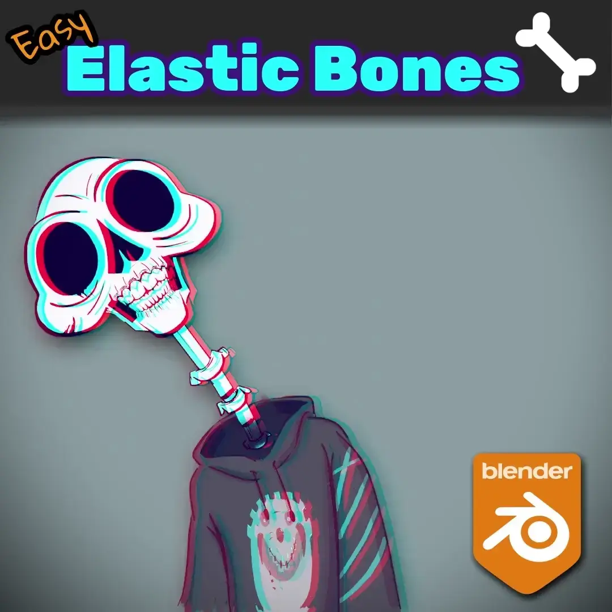
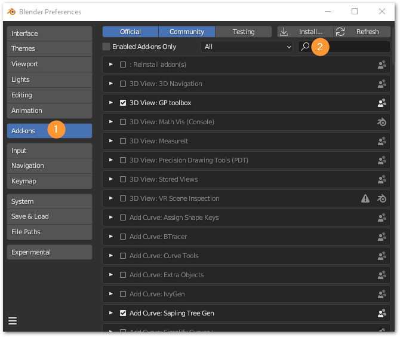
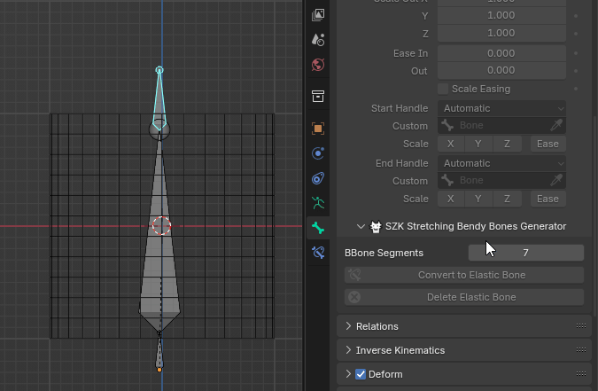
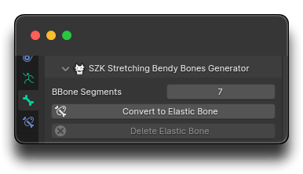

+++
title = 'SZK Easy Elastic Bones'
date = '2025-05-20T12:42:31+02:00'
description = "¡***Addon*** de **Blender** para hacer **huesos elásticos** con -literalmente- un solo click!"
lastmod = '2025-05-20T12:42:31+02:00'
# draft = true # if true (or not set), the page will be excluded in build
private = false # If true, the article wont be listed and will only be visible by knowing its url
tags = ["Blender addon", "Rigging", "Gamedev"]
# main_classes = 'pixel-font' # classes for <main> element. Allows customization of each page. Example of use: add a class from `fonts.scss` to change the page font. (consolas-font, handwritten-font, etc).
# # -------- DISPLAY OPTIONS --------
accent_color = "#EA7600" # customize the color for links, etc in the page
# show_breadcrumbs = false
show_description = false
# show_author = false
# show_date = false
# show_reading_time = false
# show_tags = false
show_table_of_contents = true
show_right_bar = true
# show_next_and_previous_arrows = false # If false (or not set), will hide the left/right arrows next to the articles' title for navigating between articles
# show_related_articles = false # If false, it wont show the related articles at the bottom. If true (or non set), they will show.
article_cover = 'images/v2_well.webp' # local path for the image used as the cover. NOTE: Check its extension! (.png set as a template)
# NOTE Since this is a leaf bundle (page in its own folder), placing an image in the same folder with the name 'cover' (no matter its extension) will be used as the cover AUTOMATICALLY. BUT if 'article_cover' is set, it will use that (this is also useful for having different covers for each language, if that is needed).
# # ------- FEATURE OPTIONS --------
# featured = true # if true, the article will be featured in the index page.
# featured_title = 'Szk Easy Elastic Bones' # if set, it will use this as the title in the featured card. If not, it will use the article's title.
# featured_description = "" # if set, the article will use this description in the featured card. If not, it will use the article's description.
# featured_tags = [""] # if set, it will only feature the tags in this array (useful to display only some of the tags). Note: Tags must match the tag in .Params.tags

+++

<!-- # SZK Easy Elastic Bones 🦴| Suzuka Ka -->

> ¡***Addon*** de **Blender** para hacer **huesos elásticos** con -literalmente- un solo click!



<!-- > Is an addon for saving time, basically. Personally I like experimenting and sometimes adding elastic bones to see if the object I'm animating could benefit from an elastic kind of motion.
>
> Creating (and later removing, leaving the rig correctly) elastic bones manually is a tedious process, specially if you are doing it for more than one bone.
>
> This addon makes that process **instantaneous**. -->

<!--  -->



# Instalación 💻

1. Descarga el archivo _.zip_ con el *addon* y guárdalo donde prefieras.
2. En ***Blender***, ve a `Editar → Preferencias`. Una vez allí, haz clic en la pestaña `Addons` y presiona el botón `Instalar` en la esquina superior derecha:

1. Selecciona el archivo _.zip_.
2. Una vez instalado, busca “`SZK Easy Elastic Bones`” en la barra de búsqueda y activa el *addon*.

# Cómo usarlo ⚙

1. Teniendo una <u>armadura seleccionada</u>, en el modo **Editar** o **Modo Pose**, **selecciona los huesos\* que quieras hacer elásticos**.


Los huesos seleccionados han de ser '*válidos*'. Esto significa que han de estar entre 2 huesos **conexos**.


Los huesos "finales" no es posible hacerlos elásticos (el botón está desactivado):

 

Un hueso elástico necesita estar entre 2 huesos (conexos) para determinar desde y hasta donde se estira.

<!-- For a bone to be able to stretch, it needs a head and a tail bone. -->



2. Ve a la pestaña de "Huesos" en el Panel de Propiedades, y luego abre la sección de **Bendy Bones menu**

3. Presiona el botón `'Convert to Elastic Bone'`


Para eliminar un hueso elástico, seleccionalo y presiona `‘Delete Elastic Bone’`


<!-- # FAQ ❔

- ***Why do you write a FAQ section if no one has asked you a single question related the add-on?***
  
    Thats a very good question. I don’t know. I guess that if I ever got asked about something “frequently” (more than 2 times), I’ll clarify it here in case it’s useful for others 🐢. -->

# Contacto 🐺

<!-- Twitter: [@SuzukaKDev](https://twitter.com/SuzukaKDev)

Mail: [suzukakadev@gmail.com](mailto:suzukakadev@gmail.com) -->

Twitter: 

Mail: 

<!--  -->


