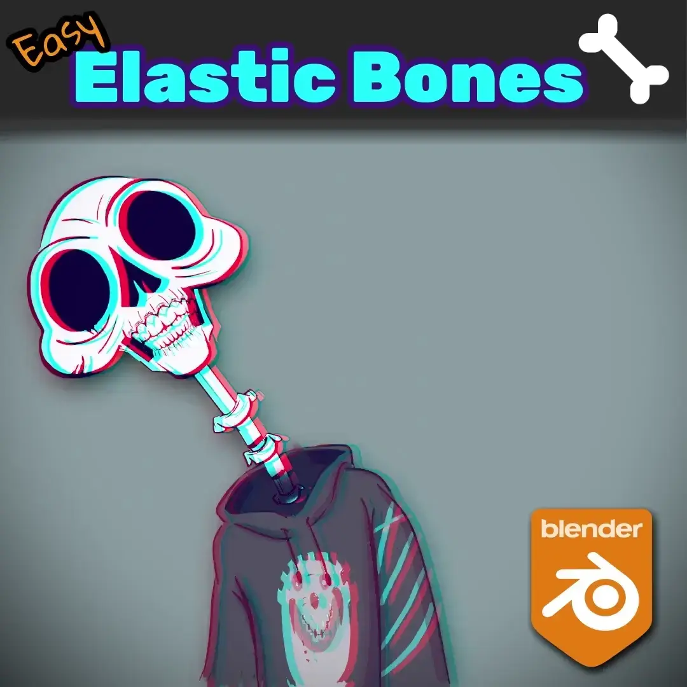

+++
title = 'SZK Easy Elastic Bones'
date = '2025-05-20T12:42:31+02:00'
description = "Blender *addon* for making cool elastic rigs!"
lastmod = '2025-05-20T12:42:31+02:00'
# draft = true # if true (or not set), the page will be excluded in build
private = false # If true, the article wont be listed and will only be visible by knowing its url
tags = ["Blender addon", "Rigging", "Gamedev", "Animation"]
# main_classes = 'pixel-font' # classes for <main> element. Allows customization of each page. Example of use: add a class from `fonts.scss` to change the page font. (consolas-font, handwritten-font, etc).
# # -------- DISPLAY OPTIONS --------
accent_color = "#EA7600" # customize the color for links, etc in the page
# show_breadcrumbs = false
show_description = false
# show_author = false
# show_date = false
# show_reading_time = false
# show_tags = false
show_table_of_contents = true
show_right_bar = true
# show_next_and_previous_arrows = false # If false (or not set), will hide the left/right arrows next to the articles' title for navigating between articles
# show_related_articles = false # If false, it wont show the related articles at the bottom. If true (or non set), they will show.
featured_image = 'images/v2_well.webp' # local path for the image used as the cover. NOTE: Check its extension! (.png set as a template)
# NOTE Since this is a leaf bundle (page in its own folder), placing an image in the same folder with the name 'cover' (no matter its extension) will be used as the cover AUTOMATICALLY. BUT if 'featured_image' is set, it will use that (this is also useful for having different covers for each language, if that is needed).
# # ------- FEATURE OPTIONS --------
# featured = true # if true, the article will be featured in the index page.
# featured_title = 'SZK Easy Elastic Bones' # if set, it will use this as the title in the featured card. If not, it will use the article's title.
# featured_description = "" # if set, the article will use this description in the featured card. If not, it will use the article's description.
# featured_tags = [""] # if set, it will only feature the tags in this array (useful to display only some of the tags). Note: Tags must match the tag in .Params.tags
# related_pages = ["articles/manuals/szk-print-to-blender-console"]
# related_pages = ["szk-print-to-blender-console", "traditional-art","szk-godot-suffixes"]
# related_pages = ["szk-easy-elastic-bones", "traditional-art","traditional-art","szk-godot-suffixes"]
+++

<!-- # SZK Easy Elastic Bones 🦴| Suzuka Ka -->

> ***Blender addon*** for easily making **elastic bones** with -literally- just a click!



<!-- > Is an addon for saving time, basically. Personally I like experimenting and sometimes adding elastic bones to see if the object I'm animating could benefit from an elastic kind of motion.
>
> Creating (and later removing, leaving the rig correctly) elastic bones manually is a tedious process, specially if you are doing it for more than one bone.
>
> This addon makes that process **instantaneous**. -->

<!--  -->



# Installation 💻

1. Download the _.zip_ file with the addon and place it wherever you like.
2. In Blender, go to `Edit → Preferences`. Once there, press the `Add-ons` tab and press `Install` button on the top-right corner:

3. Select the _.zip_ file.
4. Once installed, search for “`SZK Easy Elastic Bones`” in the search bar, and enable the addon.

# How to use it ⚙

1. Having an armature selected in **Edit** or **Pose Mode**, **select the bones** you want to make elastic.


The selected bone(s) have to be '*valid*'. This means that they should be in between two **connected** bones.


<!-- "Starting" and "ending" bones are not valid for making them elastic (the button is deactivated): -->
You cannot make the starting and ending bones elastic (notice that the button is deactivated):

 

<!-- For a bone to be able to stretch, it needs a head and a tail bone to determine from where and to where it stretches to. -->
For a bone to be able to stretch, it needs both a head and a tail bone to define the points from which it stretches and to which it stretches.



2. Go to **bone tab** in **properties panel** and then open the **Bendy Bones menu**.

3. Right there, press the button `'Convert to Elastic Bone'`.


To remove an elastic bone, simply select an elastic bone and press `‘Delete Elastic Bone’`


# FAQ ❔

- ***Why do you write a FAQ section if no one has asked you a single question related the add-on?***
  
    Thats a very good question. I don’t know. I guess that if I ever got asked about something “frequently” (more than 2 times), I’ll clarify it here in case it’s useful for others 🐢.

# Contact 🐺

<!-- Twitter: [@SuzukaKDev](https://twitter.com/SuzukaKDev)

Mail: [suzukakadev@gmail.com](mailto:suzukakadev@gmail.com) -->

Twitter: 

Mail: 

<!--  -->






