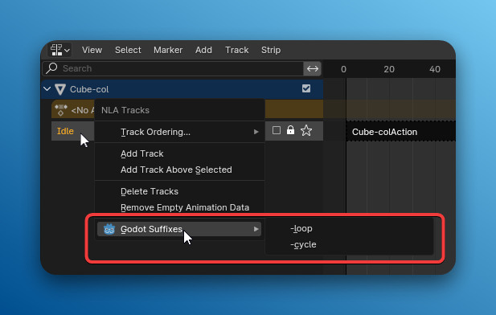
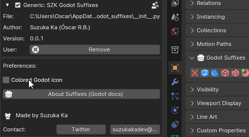

+++
title = 'SZK Godot Suffixes'
date = '2025-05-18T13:28:38+02:00'
description = "Addon para Blender para gestionar fácilmente los distintos sufijos de importación de Godot"
lastmod = '2025-05-18T13:28:38+02:00'
# draft = true # if true (or not set), the page will be excluded in build
private = false # If true, the article wont be listed and will only be visible by knowing its url
tags = ["Blender Addon", "Godot", "Gamedev", "3D"]
# main_classes = 'pixel-font' # classes for <main> element. Allows customization of each page. Example of use: add a class from `fonts.scss` to change the page font. (consolas-font, handwritten-font, etc).
# # -------- DISPLAY OPTIONS --------
accent_color = "#57A2D8FF" # customize the color for links, etc in the page
# show_breadcrumbs = false
show_description = false
# show_author = false
# show_date = false
# show_reading_time = false
# show_tags = false
show_table_of_contents = true
show_right_bar = true
# show_next_and_previous_arrows = false # If false (or not set), will hide the left/right arrows next to the articles' title for navigating between articles
# show_related_articles = false # If false, it wont show the related articles at the bottom. If true (or non set), they will show.
# featured_image = 'szk-godot-suffixes.png' # local path for the image used as the cover. NOTE: Check its extension! (.png set as a template)
# NOTE Since this is a leaf bundle (page in its own folder), placing an image in the same folder with the name 'cover' (no matter its extension) will be used as the cover AUTOMATICALLY. BUT if 'featured_image' is set, it will use that (this is also useful for having different covers for each language, if that is needed).
# # ------- FEATURE OPTIONS --------
# featured = true # if true, the article will be featured in the index page.
# featured_title = 'Szk Godot Suffixes' # if set, it will use this as the title in the featured card. If not, it will use the article's title.
# featured_description = "" # if set, the article will use this description in the featured card. If not, it will use the article's description.
# featured_tags = [""] # if set, it will only feature the tags in this array (useful to display only some of the tags). Note: Tags must match the tag in .Params.tags

+++

> *Addon* de **Blender** para gestionar fácilmente los sufijos de **Godot** al importar escenas desde archivos *.blend* a Godot.



<!-- # SZK Godot Suffixes  | Suzuka Ka  -->

<!-- > Basically avoids having to remember all the suffixes (or having to check them in the docs) and avoid (posibly) silly errors when typing them manually . -->

# Instalación 💻

1. Descarga el archivo _.zip_ con el *addon* y guárdalo donde prefieras.
2. En ***Blender***, ve a `Editar → Preferencias`. Una vez allí, haz clic en la pestaña `Addons` y presiona el botón `Instalar` en la esquina superior derecha:

1. Selecciona el archivo _.zip_.
2. Una vez instalado, busca “`SZK Godot Suffixes`” en la barra de búsqueda y activa el complemento.

# ¿Cómo se usa? 🔨

Puedes encontrar el *addon*:

- En el `Panel de propiedades -> Pestaña de objeto`



  <!-- 

  Press the icons to toggle each suffix. -->

- Al hacer click con el  en un objeto en el panel `Outliner -> Godot Suffixes`:

- Para sufijos relacionados con animaciones (`-loop`, `-cycle`), puedes acceder desde el menú contextual de una pista en el _Editor NLA_: 

# Ajustes ⚙

- `Colored Godot icon` 
  - Si lo desactivas, el icono de Godot se verá sin colores en la interfaz:

  

<!-- # Contact ✉  -->
# Contacto ✉

Twitter: 

Mail: 

<!-- Twitter: [@SuzukaKDev](https://twitter.com/SuzukaKDev)

Mail: [suzukakadev@gmail.com](mailto:suzukakadev@gmail.com) -->

# Apoyar el proyecto 🍀

Si consideras que es útil y quieres apoyar el proyecto, puedes hacerlo [a través de **Gumroad**](https://orb91.gumroad.com/l/szk-godot-suffixes) (thank you 🍀).

<!--  -->


