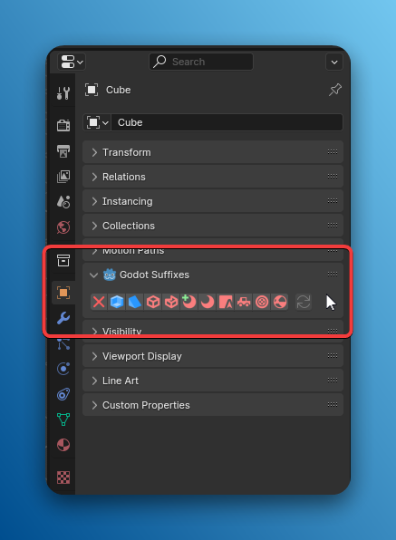
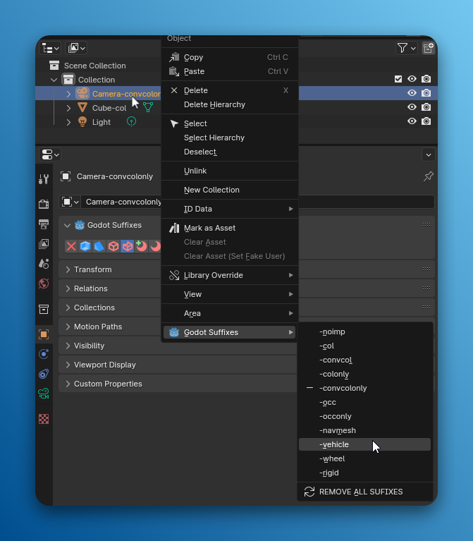
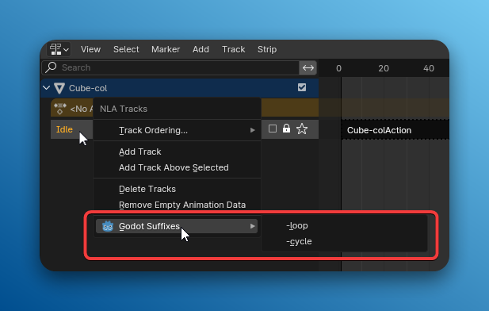
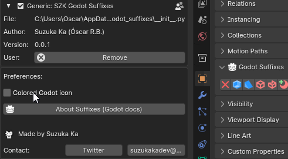

+++
title = 'SZK Godot Suffixes'
date = '2025-05-18T13:28:38+02:00'
description = "Blender addon for eassily manage import name suffixes for Godot"
lastmod = '2025-05-18T13:28:38+02:00'
# draft = true # if true (or not set), the page will be excluded in build
private = false # If true, the article wont be listed and will only be visible by knowing its url
tags = ["Blender Addon", "Godot", "Gamedev", "3D"]
# main_classes = 'pixel-font' # classes for <main> element. Allows customization of each page. Example of use: add a class from `fonts.scss` to change the page font. (consolas-font, handwritten-font, etc).
# # -------- DISPLAY OPTIONS --------
# accent_color = "#ff168a" # customize the color for links, etc in the page
# show_breadcrumbs = false
# show_author = false
# show_date = false
# show_reading_time = false
# show_tags = false
show_table_of_contents = true
show_right_bar = true
# show_next_and_previous_arrows = false # If false (or not set), will hide the left/right arrows next to the articles' title for navigating between articles
# show_related_articles = false # If false, it wont show the related articles at the bottom. If true (or non set), they will show.
# article_cover = 'szk-godot-suffixes.png' # local path for the image used as the cover. NOTE: Check its extension! (.png set as a template)
# NOTE Since this is a leaf bundle (page in its own folder), placing an image in the same folder with the name 'cover' (no matter its extension) will be used as the cover AUTOMATICALLY. BUT if 'article_cover' is set, it will use that (this is also useful for having different covers for each language, if that is needed).
# # ------- FEATURE OPTIONS --------
# featured = true # if true, the article will be featured in the index page.
# featured_title = 'Szk Godot Suffixes' # if set, it will use this as the title in the featured card. If not, it will use the article's title.
# featured_description = "" # if set, the article will use this description in the featured card. If not, it will use the article's description.
# featured_tags = [""] # if set, it will only feature the tags in this array (useful to display only some of the tags). Note: Tags must match the tag in .Params.tags

+++

# SZK Godot Suffixes  | Suzuka Ka 

This is a Blender addon for **easily managing Godot’s suffixes when importing scenes from _.blend_ files** into Godot.

> Basically avoids having to remember all the suffixes (or having to check them in the docs) and avoid (posibly) silly errors when typing them manually .

# Installation 💻

1. Download the _.zip_ file with the addon and place it wherever you like.
2. In Blender, go to `Edit → Preferences`. Once there, press the `Add-ons` tab and press `Install` button on the top-right corner:

1. Select the _.zip_ file.
2. Once installed, search for “`SZK Godot Suffixes`” in the search bar, and enable the addon.

# How to use it? 🔨

You can find the addon:

- In the `Properties Panel -> Object tab`

  

  Press the icons to toggle each suffix.

- Or via right-click in a object in the Outliner → Godot Suffixes:

- For animation related suffixes (`-loop`, `-cycle`), you can find it via right click in a NLA Track in the _NLA Editor_:

### Addon Settings ⚙

- `Colored Godot icon` - If disabled, the Godot’s icon will be displayed without colors in the UI.
  

# Contact ✉ 

Twitter: 

Mail: 

Twitter: [@SuzukaKDev](https://twitter.com/SuzukaKDev)

Mail: [suzukakadev@gmail.com](mailto:suzukakadev@gmail.com)

# Support 🍀

If you wish to support the addon you can do it [by **getting it via Gumroad**](https://orb91.gumroad.com/l/szk-godot-suffixes) (thank you 🍀).
