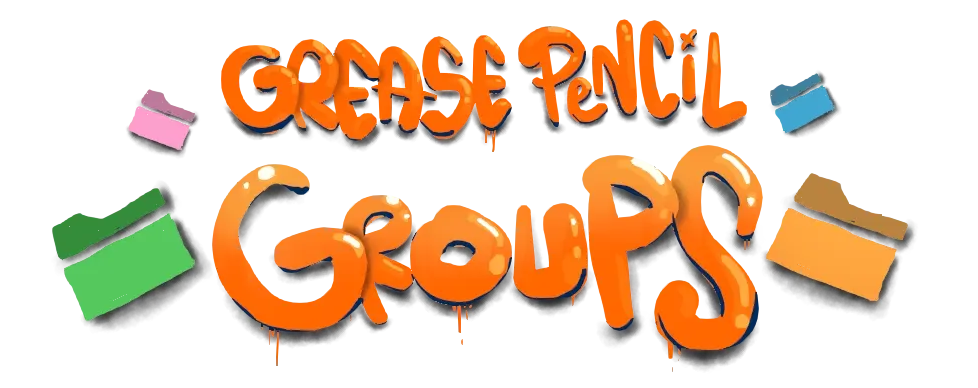
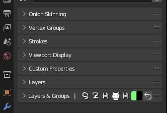
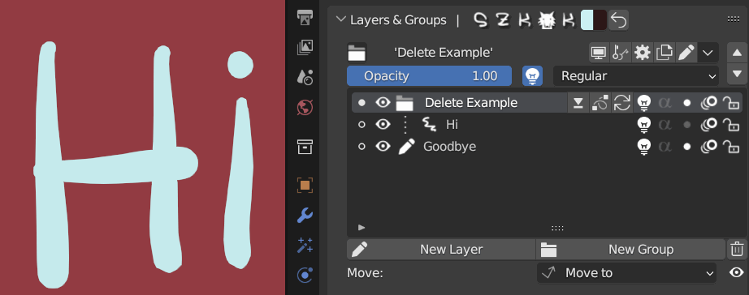
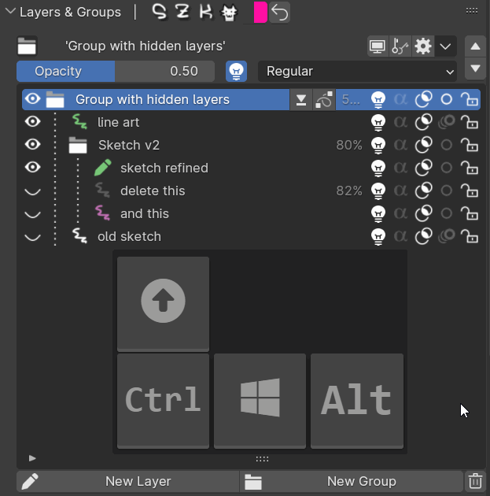
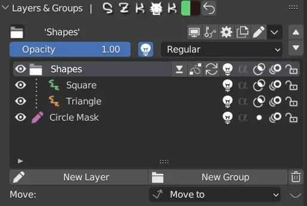
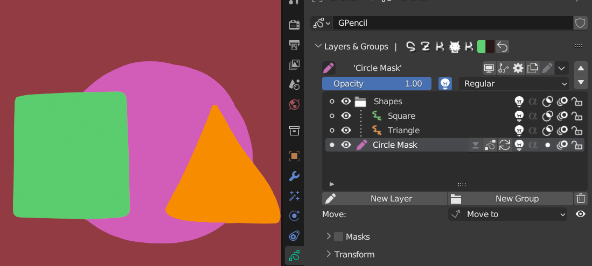
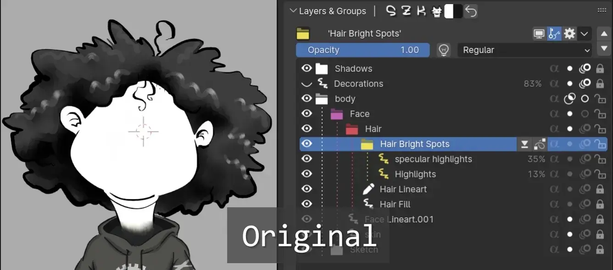

+++
# TODO traducir archetype (ES)
title = 'Szk Grease Pencil Groups++'
date = '2025-05-20T19:01:56+02:00'
description = "*Addon* para Blender que añade muchas mejoras al *Grease Pencil*!"
lastmod = '2025-05-20T19:01:56+02:00'
# draft = true # if true (or not set), the page will be excluded in build
private = false # If true, the article wont be listed and will only be visible by knowing its url
tags = ["Blender addon", "Animation", "Grease Pencil"]
# main_classes = 'pixel-font' # classes for <main> element. Allows customization of each page. Example of use: add a class from `fonts.scss` to change the page font. (consolas-font, handwritten-font, etc).
# # -------- DISPLAY OPTIONS --------
accent_color = "#EA7600" # customize the color for links, etc in the page
# show_breadcrumbs = false
# show_description = false
# show_author = false
# show_date = false
# show_reading_time = false
# show_tags = false
show_table_of_contents = true
show_right_bar = true
# show_next_and_previous_arrows = false # If false (or not set), will hide the left/right arrows next to the articles' title for navigating between articles
# show_related_articles = false # If false, it wont show the related articles at the bottom. If true (or non set), they will show.
# article_cover = 'images/cover600x600v2.gif' # local path for the image used as the cover. NOTE: Check its extension! (.png set as a template)
# NOTE Since this is a leaf bundle (page in its own folder), placing an image in the same folder with the name 'cover' (no matter its extension) will be used as the cover AUTOMATICALLY. BUT if 'article_cover' is set, it will use that (this is also useful for having different covers for each language, if that is needed).
# # ------- FEATURE OPTIONS --------
# featured = true # if true, the article will be featured in the index page.
# featured_title = 'Szk Grease Pencil Groups++' # if set, it will use this as the title in the featured card. If not, it will use the article's title.
# featured_description = "" # if set, the article will use this description in the featured card. If not, it will use the article's description.
# featured_tags = [""] # if set, it will only feature the tags in this array (useful to display only some of the tags). Note: Tags must match the tag in .Params.tags

+++

> Este addon de Blender **`agrega funcionalidad de grupos` (**) a **¡el Grease Pencil de Blender!**
<!--  -->


Está diseñado para hacer que trabajar con el Grease Pencil sea una experiencia más agradable (¡y organizada!) y para realizar tareas redundantes más rápidamente.
Además, también ofrece algunas pequeñas funciones nuevas que hacen que dibujar con el Grease Pencil sea más parecido a dibujar con otros programas gráficos.
> Hice (¡y **estoy haciendo!**) este addon para mi uso diario para simplificar un poco mi vida, y estoy añadiendo continuamente cada mejora e idea que se me ocurre, ¡así que está asegurada la máxima calidad posible!
Si tienes una idea o algo que creas que sería genial implementar, ¡estoy abierto a escuchar!
> 
# Instalación 💻
1. Descarga el archivo .zip con el addon y colócalo donde quieras.
2. En Blender, ve a `Editar → Preferencias`. Una vez allí, presiona la pestaña `Complementos` y pulsa el botón `Instalar` en la esquina superior derecha:

3. Selecciona el archivo .zip.
4. Una vez instalado, busca “Grease Pencil Groups” en la barra de búsqueda y activa el addon.
# Configuración 🛠
El panel del addon aparecerá en el `Panel de propiedades`, junto con el panel original de capas.
Para empezar a usarlo, simplemente haz clic en el botón Inicializar para añadir las capas actuales en el Grease Pencil activo:


💡 Nota: añadir una capa **fuera** del panel de Capas y Grupos hará que el sistema de grupos quede **desactualizado**.
Si es así, no te preocupes, aparecerá un botón para refrescar los cambios.
> Personalmente sugiero que si prefieres usar el panel del addon en lugar del panel antiguo de capas, simplemente arrástralo hacia arriba (o donde quieras), para que no lo pierdas de vista:


Podría haber sobrescrito el panel de capas predeterminado de Blender, pero personalmente no me gusta eliminar elementos originales de la interfaz, por si algunos usuarios quieren seguir usando el panel nativo de capas.


# Interfaz 🖥️

**CONSEJO**: Cada botón está documentado y muchos operadores tienen diferentes opciones cuando se presionan con //. Todo está explicado en su tooltip. **Consulta el tooltip** (pasando el cursor del ratón) **para descubrir nuevos atajos y funcionalidades**.


# Manual ⚙
## Añadir Capas/Grupos `+`
Usa los botones  y  para añadir nuevos elementos.
1. **Añadir Capa ✏:** 
    1. Mantén  para añadir la nueva capa **encima** del elemento seleccionado
    2. Mantén  cuando un **grupo cerrado** esté **seleccionado**, para añadir la nueva capa dentro de él.
    3. Mantén  para añadir la nueva capa **debajo** del grupo/capa seleccionada
2. **Añadir Grupo 📂:**
    1. Mantén  para colocar el **elemento seleccionado** dentro del **nuevo grupo**.
    2. Mantén  mientras tienes seleccionado un grupo para **colocar el nuevo grupo dentro del seleccionado**.
    3. Mantén  para añadir un grupo **debajo** del elemento seleccionado.
    4. Mantén  para añadir un nuevo grupo y **meter dentro todos los elementos que están debajo**.
### Eliminar una Capa/Grupo ❌
Haz clic en el **icono de la papelera**  junto al botón  para **eliminar un elemento**.

Si el elemento seleccionado es un grupo, solo eliminará el grupo, pero dejará todos sus hijos.


Puedes **eliminar** el **grupo y todo su contenido** presionando el botón de eliminar mientras mantienes .



**Consejo**: Presiona  para limpiar un Grupo 🧹:

Esto **eliminará todas las capas ocultas** dentro de un grupo.

## Editar capas y grupos
Cambiar una propiedad en una capa afectará solo a esa capa. **Modificar una propiedad en un grupo afectará a todas sus capas y grupos contenidos**.

Ocultar el grupo ocultará todos sus elementos. Además, añadir una máscara a un grupo añadirá esa máscara a todos sus hijos. Si editas máscaras en un grupo, todos sus hijos serán editados.
## Mover elementos ⤴
Puedes mover fácilmente los elementos usando los botones de flecha:

Si necesitas mover un elemento “más lejos” y no quieres moverlo paso a paso, puedes usar el panel `Mover a`:

Allí, simplemente haz clic en un elemento para poner el elemento seleccionado dentro/encima/debajo de él (manteniendo `SHIFT`/`CONTROL` (consulta el panel para más información)).

Puedes activar el panel Mover en la Vista 3D presionando  mientras estás en Modo Pintura


**Consejo**: Si quieres mover los elementos más rápido y directamente desde la vista de lista y evitar el menú de mover, puedes presionar el botón 👁️️ junto al panel `Mover a` para mostrar/ocultar los botones/operadores de mover:

Al hacer clic en los **puntos** a la izquierda, moverás la capa/grupo activo como en el panel `Mover a`.
Además, **los mismos atajos de mover se aplican aquí** (consulta el tooltip para más info):


## Fusionar Grupos y Capas ⬇
**Puedes** fusionar capas como de costumbre, pero también **combinar todo el contenido de un grupo**.

También puedes **copiar un grupo en una sola capa**:

Puedes encontrar el operador de fusión (y otros) en el menú desplegable accesible con este botón en la barra superior:


**Consejo**: Puedes decidir qué operadores mostrar en la capa/grupo y en la barra superior con [***“operadores favoritos”*** en preferencias](#favourite-operators)

El addon viene con una **forma mejorada de fusionar capas** cuando su opacidad es menor que 1.0*

<strong>*</strong>Blender no fusiona correctamente las capas cuando tienen transparencia.

Con el comportamiento normal de fusión de Blender (la transparencia cambia)
 
💪Con la forma **mejorada** de fusionar:

El resultado es más **fiel** al estado original (sin fusionar capas).

Para activar este modo, presiona  al ejecutar el operador.
Esto lo configura manualmente (siendo más lento para fusionar, pero ofreciendo mejores resultados)
## Personalizar colores 🎨
Puedes **editar los colores de las capas/grupos** haciendo clic en su icono junto al nombre en la parte superior de la lista:


**Consejo**: Al cambiar el color de un grupo, puedes:
- mantener  para **cambiar** el color de **todos los grupos hijos** 📂
- mantener  para **cambiar** el color de **todas las capas** ✏
- mantener  para **cambiar el color de todos los hijos** ✏&📂

## Abrir/cerrar grupos 📂
Haz clic en el icono de carpeta para abrir/cerrar un grupo.

Puedes mantener  mientras haces clic para **abrir/colapsar todos los hijos**.
Puedes abrir/colapsar todos los grupos en la lista presionando un icono de carpeta mientras mantienes .

**Consejo**: Puedes presionar  **en el icono del grupo** para **añadir el elemento de abajo** directamente **al grupo**.
Presiona  para desagrupar el último elemento en el grupo.

Presiona  para **añadir el elemento de abajo a un grupo**.

Presiona  para **desagrupar el último elemento en el grupo**.

## Modos Solo 🔍
El modo solo de Blender  
> Originalmente, **al salir del modo solo todas las capas se volvían visibles** (sin importar si estaban ocultas originalmente), **perdiendo los estados de visibilidad previos**.
Con este addon, **no pierdes ningún cambio en tu dibujo ya que guarda su estado previo**.
Puedes poner en solo la visibilidad 👁️ y el estado de bloqueo 🔐 de las capas/grupos.

El modo solo de bloqueo es especialmente *-súper-* útil (❗) cuando esculpes, editas los trazos, pintas pesos, mueves fotogramas en la dopesheet, etc. (¡yo lo uso mucho!)

Puedes encontrarlos en el menú (junto a las flechas de mover). O puedes añadir un atajo para ello ([ver Operadores Favoritos en Preferencias](#favourite-operators)).
Ambos modos solo <u>ofrecen diferentes **niveles de filtro**</u>:
1. **Seleccionado** - Solo el elemento seleccionado será visible. Si el elemento seleccionado es un grupo, todos sus descendientes serán visibles.
2. **Hermanos** - Solo el elemento seleccionado y sus hermanos serán visibles.
3. **Carpeta superior** - Todos los elementos en la carpeta raíz (en caso de existir) serán visibles.

Ofrece 2 posibilidades para el modo solo de visibilidad:
- Ocultar capas
- Desvanecimiento de opacidad
[Lee sobre ellos aquí](#settings-).
## Alfa heredado 🖌
**Haz clic** en el **botón alfa** junto a las propiedades de la capa/grupo para activarlo.

Cuando el alfa heredado está activado, el contenido de la capa/grupo solo será visible dentro de la opacidad de sus hermanos.

En este ejemplo, el color base y la sombra fueron dibujados sin considerar si salían o no del contorno de la bola. Al activar el alfa, su contenido se recorta por la opacidad de sus hermanos, encajando perfectamente en la silueta de la bola.

Esta fue una función que pretende imitar el [**alfa heredado de Krita**](https://docs.krita.org/en/tutorials/clipping_masks_and_alpha_inheritance.html).
# Preferencias 🛠
## Ajustes ⚙
- `Usar luces por defecto` - Si es True, (sin padre*) **las nuevas capas** y grupos **usarán luces cuando se creen**. 

*Si se crean dentro de un grupo, **heredarán** las propiedades actuales del grupo.

- `Mantener colores de vértice al cambiar pinceles` - Por defecto, cada pincel tiene su color principal y secundario, por lo que pierdes el color seleccionado al cambiar a otro pincel. Útil cuando quieres usar otro pincel por su textura pero quieres seguir pintando con el color que tenías seleccionado.
- `Modo de visibilidad solo` - Selecciona el método usado al poner en solo la visibilidad de las capas.
    - Ofrece 2 opciones:
        1. **Ocultar capas**: solo las capas filtradas serán visibles, mientras las otras estarán completamente ocultas.
            
            
         
        2. **Desvanecimiento de opacidad**: las capas filtradas serán visibles con su opacidad original, mientras el resto se desvanecerá según el porcentaje de opacidad seleccionado en preferencias.
            
            
         
- `Prefijos/Sufijos al duplicar` - Establece los prefijos (izquierda) y sufijos (derecha) añadidos al duplicar un grupo y una capa.
- `Chequeo automático de nuevas versiones` - Si es True (recomendado), el addon comprobará automáticamente si hay una versión más reciente subida.
    

Esta comprobación ocurre solo una vez al cargar Blender

    
### Apariencia 👁️
- `Iconos de visibilidad en el lado izquierdo` - Si es True, el icono de ocultar/mostrar se colocará a la izquierda (como en otros programas gráficos como *Krita* o *Photoshop*).

- `Mostrar propiedades en la lista` - Decide si mostrar o no información extra en la lista.
    1. **Usar luces** - Indica si la capa/grupo está afectada por luces
    2. **Modo de fusión** - Muestra un icono con el modo de fusión usado cuando es diferente a ‘Regular’
    3. **Opacidad** - Muestra la opacidad directamente en la lista cuando es diferente a 100%.
        
        
        
    
    1. **Padre** - Muestra un icono de hueso cuando la capa/grupo está parentada a otro objeto.
    
    
    
<!-- ### Operadores Favoritos ⭐ -->
### Operadores Favoritos
Puedes seleccionar tus acciones favoritas para mostrarlas en la barra superior y en la capa/grupo seleccionado.


Pasa/coloca el ratón sobre los iconos para ver su función.

# Atajos ⌨
Atajos para las nuevas funcionalidades.
## Grease Pencil `Modo Pintura` 🖌
 - Cambiar entre color principal y secundario
 - Cambiar entre Dibujar y Borrador
 - Cambiar entre Modo Pintura y Esculpir
 - Tomar/muestrear color de vértice bajo el ratón. (¡No necesitas ir manualmente al color cada vez para activar el cuentagotas❗ 🎉🥳)

Los colores se están muestreando directamente de las letras mientras pintas (No necesitas ir a la propiedad y presionar  para activar el cuentagotas 🥳)
 - Seleccionar pincel anterior.
 - (En Vista 3D) Mostrar “Panel Mover”
## Grease Pencil `Modo Edición` 📐
 - (En Vista 3D) Mover trazos seleccionados a otra capa
---

# Preguntas Frecuentes❔
- ***¿Por qué escribes una sección de Preguntas Frecuentes si nadie te ha hecho una sola pregunta relacionada con el complemento?***
    
    Esa es una muy buena pregunta. No lo sé. Supongo que si alguna vez me preguntan algo “frecuentemente” (más de 0 veces), lo aclararé aquí por si es útil para otros 🐢.
    
- ***¿Por qué pusiste iconos en el encabezado?***
    
    Personalmente me gusta cuando puedo distinguir claramente cuando alguna funcionalidad viene de un complemento que tengo instalado y no es algo nativo de Blender. Además, como decidí no sobrescribir el panel original de Capas (por si alguien quiere seguir usándolo mientras tiene este complemento instalado), quise hacer que el panel destaque del otro.
    
    - Además, me gusta mostrar a mi perro, Dex:
        
        
        
        <!--  -->
        
        <!--  -->
        
        <!--  -->
        
        <!-- .jpeg) -->
        
# Contacto ✉
<!-- Twitter: [@SuzukaKDev](https://twitter.com/SuzukaKDev)
Mail: [suzukakadev@gmail.com](mailto:suzukakadev@gmail.com) -->
Twitter: 
Mail: 
---
<!-- Página de Gumroad: [Grease Pencil Groups ++](https://orb91.gumroad.com/l/grease-pencil-groups) -->
