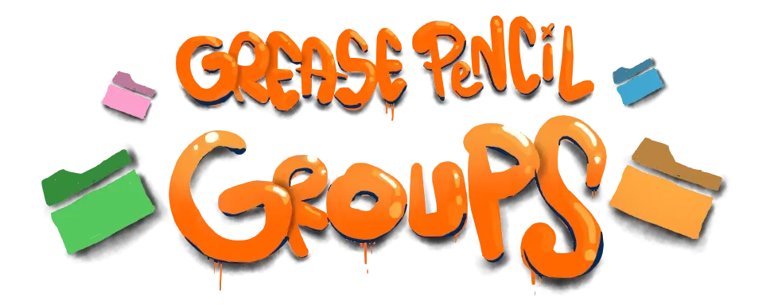
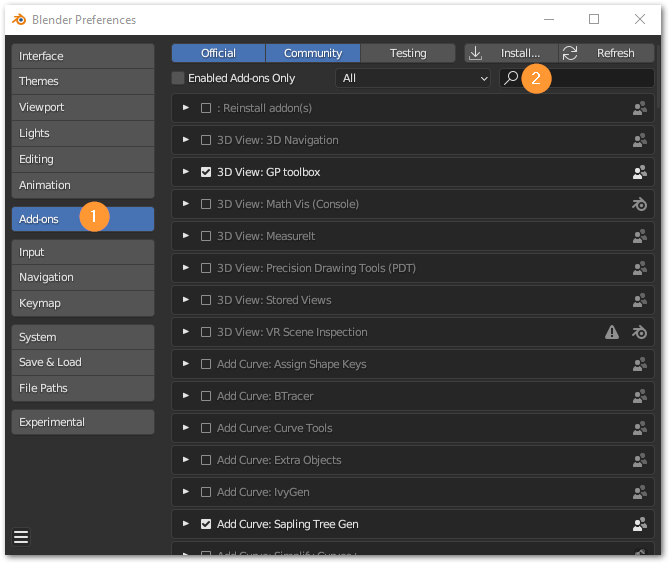
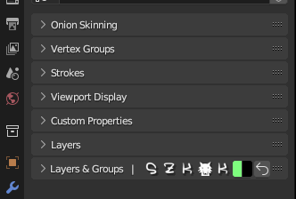

+++
title = 'SZK Grease Pencil Groups++'
date = '2025-05-20T19:01:56+02:00'
description = ""
lastmod = '2025-05-20T19:01:56+02:00'
# draft = true # if true (or not set), the page will be excluded in build
private = false # If true, the article wont be listed and will only be visible by knowing its url
tags = ["Blender addon", "Animation", "Grease Pencil"]
# main_classes = 'pixel-font' # classes for <main> element. Allows customization of each page. Example of use: add a class from `fonts.scss` to change the page font. (consolas-font, handwritten-font, etc).
# # -------- DISPLAY OPTIONS --------
accent_color = "#EA7600" # customize the color for links, etc in the page
# show_breadcrumbs = false
# show_description = false
# show_author = false
# show_date = false
# show_reading_time = false
# show_tags = false
show_table_of_contents = true
show_right_bar = true
# show_next_and_previous_arrows = false # If false (or not set), will hide the left/right arrows next to the articles' title for navigating between articles
# show_related_articles = false # If false, it wont show the related articles at the bottom. If true (or non set), they will show.
# article_cover = 'szk-grease-pencil-groups++.png' # local path for the image used as the cover. NOTE: Check its extension! (.png set as a template)
# NOTE Since this is a leaf bundle (page in its own folder), placing an image in the same folder with the name 'cover' (no matter its extension) will be used as the cover AUTOMATICALLY. BUT if 'article_cover' is set, it will use that (this is also useful for having different covers for each language, if that is needed).
# # ------- FEATURE OPTIONS --------
# featured = true # if true, the article will be featured in the index page.
# featured_title = 'Szk Grease Pencil Groups++' # if set, it will use this as the title in the featured card. If not, it will use the article's title.
# featured_description = "" # if set, the article will use this description in the featured card. If not, it will use the article's description.
# featured_tags = [""] # if set, it will only feature the tags in this array (useful to display only some of the tags). Note: Tags must match the tag in .Params.tags

+++

> This Blender add-on **`adds groups functionality` (**) to **Blender’s Grease Pencil!**

<!--  -->





It’s meant to make working with the Grease Pencil a more pleasant (and organized!) experience and to perform redundant tasks more quickly.
Moreover, it also provides some new little features that make drawing with Grease Pencil more alike to drawing with other graphic softwares.

> I made (and **I’m making!**) this addon for my daily use to simplify my life a bit, and I’m continously adding every improvement and idea I can think of, so its ensured to have the maximum quality possible!
If you have an idea or something that you think will be cool to be implemented, I’m open to listen!
> 

# Installation 💻

1. Download the .zip file with the addon and place it wherever you like.
2. In Blender, go to `Edit → Preferences`. Once there, press the `Add-ons` tab and press `Install` button on the top-right corner:

3. Select the .zip file.
4. Once installed, search for “Grease Pencil Groups” in the search bar, and enable the addon.

# Setup 🛠

The add-on pannel will appear in the `Properties panel`, along with the original layer panel.

To start using it, simply click the Initialize button to add the current layers in the active Grease Pencil:


💡 Note: adding a layer **outside** the Layers & Group panel will make the group system to be **outdated**.
If so, don’t worry, a button will appear to refresh changes.

> I personally suggest that if you preffer to use the add-on panel instead of the old layer panel, just drag it on top (or whereever you like), so you don’t miss it:


I could have overriden Blender’s default layer panel, but I personally don’t like to get rid of original UI elements, in case some users would like to still use the native layer panel.




# Interface 🖥️


**TIP**: Every button is documented and lots of operators have different options when they are pressed with //. Everything is explained in their tooltip. **Check the tooltip** (by hoovering the mouse cursor) **to discover new shortcuts and functionality**.


# Manual ⚙

## Adding Layers/Groups `+`

Use the  and  buttons to add new elements.

1. **Add Layer ✏:** 
    1. Hold  to add the new layer **above** the selected element
    2. Hold  when a **closed group** is **selected**, to add the new layer into it.
    3. Hold  to add the new layer **below** the selected group/layer
2. **Add Group 📂:**
    1. Hold  to place the **selected element** into the **new group**.
    2. Hold  while having selected a group to **place the new group inside the selected**.
    3. Hold  to add a group **below** the selected item.
    4. Hold  to add a new group and **put all the elements that are below it inside**.

### Deleting a Layer/Group ❌

Click the **trash icon**  next to the  button to **delete an element**.

If the selected element is a group, it will only delete the group, but leaves all their children.




You can **delete** the **group and all its content** by pressing the delete button while holding .





**Tip**: Press  to clean a Group 🧹:

This will **delete all hidden layers** inside a group.



## Editing layers and groups

Changing a property in a layer will affect only to that layer. **Modifying a property in a group, will affect to all its layers and groups contained**.

Hiding the group will hide all its elements. Also, adding a mask to a group will add that mask to all its children. If you edit masks in a group, all their children will be edited.

## Moving elements ⤴

You can easily move the elements using the arrow buttons:

If you need to move an element “farther” and don’t want to move it step by step, you can use the `Move To` panel:

There, simply click an element to put the selected element inside/above/below it (by holding `SHIFT`/`CONTROL` (see the panel for more information)).



You can trigger the Move panel in the 3D View by pressing  while being in Paint Mode





**Tip**: If you want to move the elements faster and directly from the list view and bypass the move menu, you can press the 👁️️ button next to the `Move To` panel to show/hide the move buttons/operators:

By clicking the **dots** on the left, you will move the active layer/group like in the `Move To` panel. 

Also, **the same moving hotkeys apply here** (see the tooltip for more info):



## Merging Groups & Layers ⬇

**You can** merge layers as usual, but also **combine the entire content of a group**.

You can also **copy a group into a single layer**:

You can find the merge operator (and others) in the drop down menu accesed by this button in the top bar:


**Tip**: You can decide what operators to show in the layer/group and top bar with [***“favourite operators”*** in preferences](#favourite-operators)


The addon comes with an **improved way to merge layers** when their opacity is lower than 1.0*



<strong>*</strong>Blender don’t merge correctly the layers when they have transparency.

With Blender’s normal merge behaviour (the transparency changes)

 

💪With the **improved** way to merge:

The result more **faithful** to the original state (without merging layers).


To activate this mode, press  when executing the operator.

This will manually sets the (being slower to merge, but offering better results)

## Customize Colors 🎨

You can **edit the layer/groups colors** by clicking their icon next to the name at the top of the list:



**Tip**: When changing the color of a group, you can:
- hold  to **change** the color of **all child groups** 📂
- hold  to **change** the color of **all layers** ✏
- hold  to **change all children's colors** ✏&📂



## Open/close groups 📂

Click the folder icon to open/close a group. 

You can hold  while clicking to **open/collapse all children**.

You can open/collapse all groups in the list by pressing a folder icon while holding .



**Tip**: You can press  **in the group icon** to **add the element at the bottom** directly **to the group**.

Press  to ungroup the last element in the group.

Press  to **add the element below to a group**.

Press  to **ungroup the last element in the group**.



## Solo Modes 🔍

Blender’s solo mode  

> Originally, **after exiting the solo mode all layers became visible** (no matter if they were originally hidden), **loosing the previous visibility states**.

With this addon, **you don’t loose any change on your drawing since it saves its previous state**.

You can solo the layers/groups visibility 👁️ and lock 🔐 state.


The lock solo mode is specially *-super-* useful (❗) when sculpting, editing the strokes, weight painting, moving frames in the dopesheet, etc. (I use it a lot!)


You can find them in the menu (next to the move arrows). Or you can add a shortcut to it ([see Favourite Operators in Preferences](#favourite-operators)).

Both solo modes <u>offers different **filter levels**</u>:

1. **Selected** - Only the selected element will be visible. If the selected element is a group, all its descendants will be visible.
2. **Siblings** - Only the selected element and its siblings will be visible.
3. **Top folder** - All elements in the root folder (in case of existing) will be visible.

It offers 2 possibilities for the visibility **solo mode**: 
- Hide layers
- Opacity fade

[Read about them here](#settings-).

## Inherited alpha 🖌

**Click** the **alpha button** next to the layer/groups properties to activate it.


When Inherited alpha is enabled, the layer/group content will only be visible in their sibling’s opacity.

In this example, the base color and the shadow were drawn without considering whether they went outside the contour of the ball or not. When activating the alpha, its content is clipped by their siblings’ opactity, fitting perfectly into the ball’s silhouette.


This was a feature that prettends to imitate [**Krita**’s inherited alpha](https://docs.krita.org/en/tutorials/clipping_masks_and_alpha_inheritance.html).

# Preferences 🛠

## Settings ⚙

- `Use lighs by default` - If True, (unparented*) **new layers** and groups **will use lights when they are created**. 

*If they are created inside a group, they will **inherit** the group’s current properties.


- `Keep Vertex colors when changing brushes` - By default, each brush has its own main and secondary colour, so you lost the colour you had selected when changing to a new brush. Useful when you want to use another brush for its texture but you want to continue painting with the colour you had selected.

- `Solo visibility mode` - Select the method used when soloing the layers’ visibility. 
    - Offers 2 options:
        1. **Hide layers**: only the layers filtered will be visible, while the others will be completely hidden.
            
            
         
        2. **Opactiy fade**: the layers filtered will be visible with its original opacity, while the rest will be faded by the selected opacity percentage in prefferences.
            
            

         

- `Duplicate Prefixes/Suffixes` - Set the prefixes (left) and suffixes (right) added when duplicating a group and a layer.
- `Automatic check for new versions` - If True (recommended), the addon will automatically check if there is a newer version uploaded.
    

This check happens only once when loading Blender

    

### Appearance 👁️

- `Visibility icons on the left side` - If True, the hide/show icon will be placed on the left (like in other graphic softwares like *Krita* or *Photoshop*).

- `Show properties in list` - Decide if showing of not extra info in the list.
    1. **Use lights** - Indicates if the layer/group is affected by lights
    2. **Blend Mode** - Shows an icon with the blend mode used when is different than ‘Regular’
    3. **Opacity** - Shows the opacity directly in the list when it is different than 100%.
        
        
        
    
    1. **Parent** - Show a bone icon when the layer/group is parented to another object.
    
    
    

<!-- ### Favourite Operators ⭐ -->
### Favourite Operators

You can select your favourite actions in order to show them in the top bar and in the selected layer/group. 


Hover/place the mouse over the icons to see their function.


# Hotkeys ⌨

Hotkeys for the new functionalities.

### Grease Pencil `Paint mode` 🖌

 - Switch between first and secondary color

 - Switch between Draw and Eraser

 - Switch between Paint and Sculpt mode

 - Pick/sample vertex color under mouse. (No need to manually go to the color each time to activate the color picker❗ 🎉🥳)

The colors are being sampled directly from the letters while painting (No need to go to the property and press  to activate the eyedropper 🥳)

 - Select previous Brush.

 - (In 3D View) Show “Move panel”

### Grease Pencil `Edit mode` 📐

 - (In 3D View) Move selected strokes to another layer

---

# FAQ❔

- ***Why do you write a FAQ section if no one has asked you a single question related the add-on?***
    
    Thats a very good question. I don’t know. I guess that if I ever got asked about something “frequently” (more than 0 times), I’ll clarify it here in case it’s useful for others 🐢.
    
- ***Why did you put icons on the header?***
    
    I personally like when I can distinguish clearly when some functionality comes from an addon I have installed and is not something native from Blender. Also, since I decided not to override the original Layer panel (in case someone would like to continue using it while having this addon installed), I wanted to make the panel to stand out from the other one. 
    
    - Also, I like to show my dog, Dex:
        
        
        
        <!--  -->
        
        <!--  -->
        
        <!--  -->
        
        <!-- .jpeg) -->
        

# Contact ✉

<!-- Twitter: [@SuzukaKDev](https://twitter.com/SuzukaKDev)

Mail: [suzukakadev@gmail.com](mailto:suzukakadev@gmail.com) -->

Twitter: 

Mail: 

---

<!-- Gumroad Page: [Grease Pencil Groups ++](https://orb91.gumroad.com/l/grease-pencil-groups) -->

