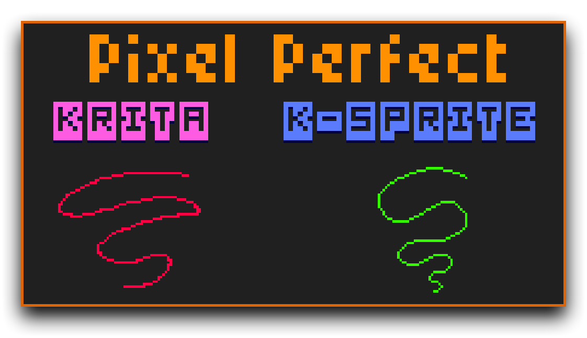

+++
title = 'SZK Krita Pixel Art Suite'
date = '2025-05-22T22:57:12+02:00'
description = "*Plugin* de Krita que añade muchas **mejoras** para dibujar ***Pixel Art***!"
lastmod = '2025-05-22T22:57:12+02:00'
# draft = true # if true (or not set), the page will be excluded in build
private = false # If true, the article wont be listed and will only be visible by knowing its url
tags = ["krita","pixel art","k-sprite"]
# main_classes = 'pixel-font' # classes for <main> element. Allows customization of each page. Example of use: add a class from `fonts.scss` to change the page font. (consolas-font, handwritten-font, etc).
# # -------- DISPLAY OPTIONS --------
# accent_color = "#ff168a" # customize the color for links, etc in the page
accent_color = "#ff950a" # customize the color for links, etc in the page
# show_breadcrumbs = false
show_description = false
# show_author = false
# show_date = false
# show_reading_time = false
# show_tags = false
show_table_of_contents = true
show_right_bar = true
# show_next_and_previous_arrows = false # If false (or not set), will hide the left/right arrows next to the articles' title for navigating between articles
# show_related_articles = false # If false, it wont show the related articles at the bottom. If true (or non set), they will show.
# featured_image = 'szk-krita-pixel-art-suite.png' # local path for the image used as the cover. NOTE: Check its extension! (.png set as a template)
# NOTE Since this is a leaf bundle (page in its own folder), placing an image in the same folder with the name 'cover' (no matter its extension) will be used as the cover AUTOMATICALLY. BUT if 'featured_image' is set, it will use that (this is also useful for having different covers for each language, if that is needed).
# # ------- FEATURE OPTIONS --------
# featured = true # if true, the article will be featured in the index page.
# featured_title = 'Szk Krita Pixel Art Suite' # if set, it will use this as the title in the featured card. If not, it will use the article's title.
# featured_description = "" # if set, the article will use this description in the featured card. If not, it will use the article's description.
# featured_tags = [""] # if set, it will only feature the tags in this array (useful to display only some of the tags). Nota: Tags must match the tag in .Params.tags
# related_pages = [""] # If set, these pages (up to 3) will be displayed in the related section for this page. Useful when you want to be sure that a page appears as related
+++

> Plugin de ****** que añade **** para hacer ****!



<!-- # Test table of contents -->




La traducción se ha realizado con la traducción **Español de España** en **Krita**.


# Instalación

1. Descarga el `.zip`.
2. En Krita, ve a ***Herramientas (Tools) ‣ Guiones (Scripts) ‣ Importar complemento de Python desde archivo***, selecciona el archivo `.zip` y presiona `OK`.
3. Reinicia Krita.
4. Ve a ***Preferenciasl ➡ Paneles ➡ SZK Pixel Art Suite***

Aparecerá un nuevo ***panel*** con el *plugin*:



## Pestañas 




<!-- 
 -->

    

    

    

    

    

    



# Gama de sombras y luces

Está inspirado el panel de gama de sombras y luces que ofrecía [*Pyxel Edit*](https://pyxeledit.com/), el cual generaba tonos para las sombras y las luces muy interesantes de forma muy sencilla. 

Añade la funcionalidad original a *Krita* y lo expande **añadiendo nuevas opciones**.



Funciona generando **distintas variaciones de tono en torno a un color de base**. Este color de base <u>estará siepre en el centro del gradiente</u> (a excepción del gradiente "mix" (Mezcla/mixer)).



La **paleta principal de sombreado** (arriba del todo), funciona desplazando/acercando el valor, la saturación y el tono (hue) del color seleccionado a un tono azul específico para las sombras (a la izquierda). Para los colores brillantes (a la derecha), funciona igual, pero desplazando los colores a un tono amarillo.

 

 - Modifica -únicamente- el **valor (luz)**.

 

 - Modifica -únicmente- la **saturación**.

 

 - Modifica -únicmente- el **tono/hue**.

 


**l**, **s** y **h** son muy útiles para modificar precisamente el color actual, mediante el  [(Ve la sección de 'Muestras')](#muestras)






Las paletas  y  están afectadas por el tono/hue de los **deslizadores** que están encima de ellas. El **deslizador de la izquierda** controla el **tono/hue** para las **sombras**, mientras que **el deslizador derecho** controla el **tono/hue** de los **tonos de luz**.

 



Esto **ofrece más control** a la hora de lograr combinaciones de colores cohesivas para pintar escenas con distintas iluminaciones.

> For example, lets say you are painting a sunset scene with an *orange* light source, and you want the shadows to gather around a pink. You can select both hues in the sliders and generate easily colors that look good in that setting.

> Por ejemplo, en el caso de que estuvieras pintando un atardecer con una luz naranja y en el que quieres que las sombras tiendan al color rosa, puedes seleccionar ambos tonos en los deslizadores. De esa forma, los colores que elijas siempre tendrán coherencia en dicha escena.



>  Usa el **mismo algoritmo** que la paleta inspirada por ***Pyxel Edit***. 
>  
>  
>  Usa un **algoritmo distinto** (normalmente ofrece colores más apagados en las sombras, y luces más vivas/coloreadas).

---


Mezcla 2 colores.


Usa un algoritmo que **comprueba la similitud entre los dos colores**, y reduce o añade más muestras en función de lo similares que sean.

(Cuanto más distintos sean, más colores añade).

> Puedes cambiar la resolución (el número de colores) con el  que hay al lado del color .



Pulsa los botones/colores  y  para cambiar los colores de la mezcla.

Dichos botones tienen los siguientesatajos/*shortcuts*:

 

| Atajo         | Acción     
| :----------- | ------: | 
|  | Invoca el panel de selección.
| | Invoca el *sampleador de color* para seleccionar cualquier color en pantalla.
| | Selecciona el **color primario**
| | Selecciona el **color secundario**.

 


Personalmente, el atajo  me parece lo más rápido y es la principal forma en la que uso el mixer.




**Para generar una paleta/gradiente**
- Presiona el botón  /  para seleccionar el color **primario/secundario** actual, y generar la paleta entorno a dicho color.
- Presiona el botón  en una muestra de color. [Lee la sección 'Muestras' para más información.](#muestras)

## Muestras

> Una '*muestra*' es cada uno de los colores que conforman el gradiente.

Atajos de ratón:
| Atajo         | Acción     
| :----------- | ------: | 
|  | Selecciona el **color primario**
| | Selecciona el **color secundario** 
| | Selecciona el **color primariod** <u>y **regenera la paleta**</u>


Personalmente, el atajo del  me parece muy util para modificar los colores con precision, al modificar su valor, hue, saturación, etc., hasta que obtengas el tono que buscas.


Cuando haces click en una muestra, el color seleccionado se vuelve activo:



Una vez seleccionado un color, puedes:

- Moverte fácilmente hacia delante/atrás en la paleta seleccionada mediante atajos de teclado. ([Échale un vistazo a la sección de atajos de teclado](#atajos-de-teclado))

- **Añadir** el gradiente a la **paleta que tengas activa**.

## Gestionando las paletas

La pestaña de *Gama de sombras y luces* está "conectada" al panel de **"Paleta"** de ***Krita***.



Ve a `Preferencias -> Paneles -> Paleta`.



 

Aparecerá un panel como este:

 





### Añadir colores a la paleta

Cuando tiene un gradiente seleccionado (tras haber seleccionado una muestra), puede añadir todos sus colores a la paleta activa. Para ello, pulsa este botón:



### Ordenar los colores de la paleta

Se ha incluido opciones para **ordenar** los colores en el panel 'Paleta' según distintos criterios (hue, valor, saturación, luz percibida, similitud de colores, etc.), al igual que existen en otros programas de dibujo.

> Esto es algo que personalmente me parece  **muy útil cuando se trabaja con paletas de colores limitadas**.

Para ordenar la paleta activa, pulse el botón :



La mayoría de las opciones se explican por sí msimas. Aunque algunas merecen ser explicadas:

- **Perceived lightness (luz percibida)**: Ordena los colores en función de cómo percibe la luz el ojo humano. No siempre coincide con la clasificación por «valor».

- **Cielab similarity (similitud Cielab)**: Ordena los colores de la paleta en función de su **semejanza** con el **color activo (primario)**.

# Remplazo de color

Permite reemplazar con precisión un color específico en las capas/grupos seleccionados o en todo el documento.

Resulta útil cuando se desea cambiar una paleta o un color determinado de todo un documento o capa.


El color a sustituir tiene que coincidir con el **color exacto** (no hay margen a la hora de comparar, el color ha de ser idéntico para ser remplazado).




 - **Color a reemplazar** (izquierda) y **el color nuevo** (derecha)



| Atajo         | Acción     
| :----------- | ------: | 
|  | Invoca el panel de selección.
| | Invoca el *sampleador de color* para seleccionar cualquier color en pantalla.
| | Selecciona el **color primario**
| | Selecciona el **color secundario**.

 


 Simplemente **manten el ratón encima (hover)** de los colores para mostrar **un panel informativo** con dichos **atajos**:







 - **Intercambia** ambos colores.


**Nota**: Por el momento **rehacer/rehacer no está soportado de forma nativa en los scripts de Krita**, así que si quieres **rehacer los cambios** puedes **intercambiar los colores** (con el botón de intercambio) y **reejecutar el reemplazo de color**.


 - **Alfa** del nuevo color (en caso de que tengas que cambiarlo).

 - Remplaza el color en **la(s) capa(s) seleccionada(s)**.


Puedes seleccionar más de una capa.


 -  **Reemplaza el color en todas las capas** del documento.

# Pintura indexada

Establece un grupo de pintura indexada para una capa (o grupo) con un solo clic.





***Index Painting*** is a technique that **automatically dithers and reduce colors on a non-pixel art artwork**. 

> Esto significa que <strong>{}</strong> , degradados, etc. para pintar y aún así obtener una estética Pixel Art. 👌

Ejemplo de la estética que se puede lograr con la pintura indexada:



Si tienes curiosidad, puedes [**aprender más sobre esta técnica aquí.**](http://danfessler.com/blog/hd-index-painting-in-photoshop)

Viene con un editor de patrones que permite crear, guardar y cargar diferentes patrones/preajustes para el efecto de *dithering*.
Esto es principalmente para experimentar y descubrir nuevos efectos/resultados.


## Interfaz



-  **Tamaño de la Matriz**: Aumentar/disminuir las filas/columnas de la matriz de dithering.

 

-  **Rotar**: Rota la matriz de dithering.


 

-  **Invertir**: Invierte el color en la matriz de dithering.


 

-  **Limpiar la matriz**: Restablece todas las celdas.


Presiónalo **dos veces** para pintar/borrar todas las celdas.


-  **Preajustes de Dither**: Elije un preajuste para la matriz de *dithering*.

-  **Guardar preajuste**: Guarda la matriz de *dithering* actual para usarla más tarde.

-  **Eliminar preajuste**: Elimina el **preajuste seleccionado**.

-  **Matriz de Dither**: Aquí puedes pintar/modificar cada celda de la matriz de dither. Cada celda representa un píxel del patrón de dither.



Hay varias maneras diferentes de pintar la matriz:
Atajo | Acción
:-- | --:
 /  | Pintar/borrar celda.
 | Añade/resta el valor de la celda.
 | Pinta de forma **gradual/más suave**.


**Consejo**: Mantén el ratón sobre una celda (**o cualquier elemento de la interfaz!**) para ver un cuadro de información con dichos shortcuts.


-  **Crear grupo de Pintura Indexada**: Pulsa para generar un grupo de Pintura Indexada a partir de la capa/grupo seleccionada.

-  **Actualizar la capa de dithering**: Vuelve a pintar la capa con el patrón de *dithering*. Viene bien para ver los cambios despues de pintar la matriz.


La capa activa debe ser la capa "Dither" o una "hermana" (estar al mismo nivel) que la capa "Dither".

Nota: La capa de dithering debe llamarse "Dither". Esto se debe a que después de presionar el botón, busca si hay un grupo de Pintura Indexada configurado con una capa de dithering.


-  **Crear capa de dithering**: Añade una capa con el patroón de *dithering* definido en la matriz.

Esto puede servir para **generar patrones de *dithering*** (y luego usarlos en pinceles, gradientes, etc).


## Configurando un grupo de Pintura Indexada

Teniendo un dibujo en **blanco y negro** (o una capa vacia, si quieres dibujar desde cero):




Nota: Es preferible si el dibujo ya consta de una silueta con los **bordes bien definidos**, ya que la Pintura Indexada tiende a generar bordes suaves/poco definidos (lo cual no suele ser una estética que se busque al hacer Pixel Art).


Pulsa el botón ***Index Painting***, en la pestaña de Pintura Indexada:



Obrendrás algo parecido a:



Crea un grupo con todo lo necesario para la Pintura Indexada.

El **grupo** consiste de:

- Un filtro de **Gradient Map** / **Index Colors**, dependiendo de tus opciones en [*Opciones de Pintura Indexada*](#opciones-de-pintura-indexada)

**Nota**: Haz  en esta capa para abrir las **Propiedades** del filtro y editar los colores de la Pintura Indexada.

- **Dither**: Esta capa contiene el patrón de *dithering* de la matriz.

Nota: Si estás usando un *Gradient Map*, puedes cambiar su patrón en las propiedades (Click Derecho en la capa -> Propiedades). Tener ambos patrones intensifica el efecto de *dithering*.

 
  
  Consejo: **Incrementa/reduce** la opacidad **opacity** de la capa **cambiar** la fuerza del efecto de *dithering*.
  

- **Gradient** (opcional, depende de tus [*Opciones de Pintura Indexada*](#opciones-de-pintura-indexada)): Ayuda a visualizar el efecto y a samplear colores.

Teniendo la capa *"Gradient"* seleccionada, puedes **samplear su color en blanco y negro** con el atajo . Esto sirve también para controlar/saber qué textura tendrá el *dither* con el valor seleccionado.


- [La capa/grupo que tenías seleccionada] (***B&W sphere*** en este ejemplo): 

# Exportación

Permite exportar el documento (o la(s) capa(s) seleccionada(s)) multiplicada por un factor, con un solo click de forma muy fácil y rápida.



Esto es útil para cuando quieres exportar tu imágen pixel art con un tamaño aumentado (para que se note que es Pixel Art).



## Opciones de la imagen

- **Escala**: Factor por el que se multiplica el tamaño de la imagen. 
- **Calidad**: La calidad de compresión de la imagen. Cuanto más alta, mayor calidad.
- **Directorio**: Soporta directorios <u>**relativos** y **absolutos**</u>.
  - **Relativos**. Ejemplo: `Exports/Version 1` exportará las imágenes en un subdirectorio relativo al directorio en el que se encuentra tu documento actual.
    - Ejemplo: Si tu documento se encuentra en `C:\Users\Dexter\Desktop\my-awesome-pixel-art.kra`, las imágenes exportadas se guardarán en `C:\Users\Dexter\Desktop\Exports\Version 1`
  - **Absoluto**. Ejemplo: Establecer un directorio absoluto (como por ejemplo: `C:\Users\Mike\Pictures\My Pixel Art`) guardará todas las imágenes exportadas en dicho directorio (**y no tendrá en cuenta el directorio del documento**).
- **File name (Nombre del fichero)**: El nombre de la imagen exportada.

Si lo dejas **<u>vacío</u>** usará **el nombre del documento**. 


- **Formato**: Selecciona el formato de la imagen. (Soporta los formatos `.png`, `.jpg`, `.webp` y `.bmp`)

## Opciones de nombrado
- **Add scale (Añadir escala)**: Si está activado, adjuntara el factor de escala al nombre de la imagen.
- **Overwrite (Sobrescribir**: Si está desactivado, añadira un sufijo único con la fecha actual, para evitar sobrescribir las imágenes que guardes.

Esto es útil si deseas guardar manualmente algunos "instantáneas" de tu dibujo y no quieres sobrescribir las imágenes.

  - Si está activado, las imágenes con el mismo nombre serán sobrescritas.

---
- **Selection only (Solo la selección)** - Si está activado, solo exportara la region seleccionada. Util para cuando quieres exportar solo un área específica del documento.
- 📁 - Haz click para abrir la carpeta donde se exportan las imágenes.
- **Export Scaled (Exportar Escalado)** - Exporta todo el documento.
- **Export Selected (Exportar Seleccionados)** - Exporta solo la capa/capas/grupos seleccionado(s).
  - **Trim (Recortar)** - Si está activado, las layers exportadas serán recortadas automáticamente. Si está desactivado, su tamaño será el mismo del documento.

Esto es útil, por ejemplo, para exportar fácilmente diferentes sprites en un mismo documento para un videojuego 🎮.


# K-Sprite

K-Sprite es un **editor de Pixel Art dentro de Krita** que está destinado a añadir todas las **características y funcionalidades** de Pixel Art que le faltan a Krita. Como un pincel pixel perfecto, mejores primitivas, líneas bezier, texto pixelado, etc.



> No está pensado para reemplazar por completo el proceso de dibujar Pixel Art en Krita (¡porque Krita sigue siendo una gran herramienta para eso!). Está destinado a **agregar todas las herramientas que le faltan a Krita** y hacer que crear Pixel Art en Krita sea  

## Tutorial

Para ejecutar **K-Sprite**, ve a la `Pestaña del Lápiz ✏️` del *docker*, o presiona el **atajo de teclado** `Open SZK K Pixel Art Editor (SZK Pixel Art Suite)` (Por defecto ).

<!-- A new window will appear on top of Krita (`1`), and will grab the active layer (`2`): -->
A new **window will appear** on top of Krita , and will **grab the active layer** :
Se abrirá una **nueva ventana**, siempre por encima de Krita , y **capturará la capa activa** :

> - **La ventana siempre se mostrará siempre en la parte superior** para que puedas **seguir usando otros dockers/plugin de krita** mientras dibujas en *K-Sprite*.
>
> - La capa activa **estará oculta temporalmente en la interfaz de Krita**. Esto se debe a que K-Sprite renderiza el documento, y tenerla visible hará que sea imposible ver los cambios en caso de que borres partes de la capa activa dentro de *K-Sprite*.


Podrás **dibujar** en la **capa que tenía seleccionada cuando ejecutaste K-Sprite**.

Esta capa **se mostrará en la parte superior (siempre visible)**, mientras que el resto del documento se renderizará al fondo.




Una vez que efectues los cambios, aparecerá como de costumbre en Krita, en su posición de capa correcta.




## Interfaz



- : Opciones de la herramienta seleccionada.
- : Diferentes acciones, deshacer/rehacer, modo solo, etc.
- : Contiene todas las **herramientas** de dibujo.
- : Aquí es donde se dibuja.
- : Guarda los cambios realizados.
- : Ofrece información acerca de la herramienta seleccionada.


### Opciones de la herramienta {.no-display}

Opciones para las diferentes herramientas de dibujo.


Estas opciones varian en función de la herramienta seleccionada.




Option | | Shortcut
:--|:--|--:
 Pixel Perfect | Hace trazos pixel art perfectos. | 
 Modo Borrador |  | 
 Modo Dither | Usa  como patrón de dibujo.| 
 Modo de relleno| Rellena una primitiva con un color. | 
 Espejo X/Y |  |  / 


### Acciones {.no-display}



Botón | | Atajo de teclado
:--|:--|--:
 Modo Solo | Muestra únicamente la capa que está siendo editada. | 
 Ajusta la vista del documento. |  | 
 Borrar todo | Borra todo el contenido de la capa que está siendo editada. | (No shortcut)
 Deshacer/Rehacer |  |  / 








### Herramientas {.no-display}
<!-- ### Tools {.no-display .underline} -->





    

    

    

    

<!--  - Squares   

 - Circles    -->

    

    

    

    





**Pincel de 1px** con opcion <u>**pixel perfect**</u> para hacer **trazos perfectos**.
**Atajo de teclado**: 

<!--  -->



Drawing Shortcuts | Action
:--|--:
 | Paint with Foreground (FG) color.
 | Paint with Background (BG) color.
 (Hold) | Make a line between from the last point to the cursor.
 (Hold) | Pick FG/BG color.

<!-- <figure>

</figure> -->

<!-- : Automatically calculates the color of a pixel by their neighbour pixels. -->



Brush for helping doing antialiasing. 
**Atajo de teclado**: 



This calculated color is a "**bridge color**" between the current pixel, and its surrounding neighbours, for achieving that antialiasing effect. [If you don't know about Pixel Art antialiasing, or want to know more, check this awesome article.](https://saint11.art/pixel_art_articles/article5/).

<!-- ❗❗❗❗❗❗❗❗❗❗❗ -->
<!-- ❗❗❗❗❗❗❗❗❗❗❗ -->
<!-- ❗❗❗❗❗❗❗❗❗❗❗ -->
<!-- ❗❗❗❗❗❗❗❗❗❗❗ -->
<!-- TODO DECOMENTAR ESTO CUANDO SUBA LA ACTUALIZACION DEL ANTIALIASING!! -->
<!-- TODO DECOMENTAR ESTO CUANDO SUBA LA ACTUALIZACION DEL ANTIALIASING!! -->
<!-- TODO DECOMENTAR ESTO CUANDO SUBA LA ACTUALIZACION DEL ANTIALIASING!! -->
<!-- It offers 2 different algorithms for calculating that antialiasing color:



-  - Selects a color by **mixing** the current pixel and its neighbours.
-  - Selects the color in the **palette** that is most similar to the painted pixel and its neighbours, while being different (without repeating the current color or the color of its neighbors).

> This is  if you are strictly using a palette, and <u>want to use **only** colors that belong to that palette</u>.

The numbers (*P4, P8, M4, M8*) reffers to the **total neighbours** of a pixel that are **considered** in the algorithm:



-  - Takes in consideration 4 neighbours of a pixel.
-  - Takes in consideration all the neighbours of a pixel. -->

<!-- <figure>

</figure> -->



Tool for creating lines. 
**Atajo de teclado**: 

<!-- : Makes a **straight line**. Press  to **snap** the line into perfect ratio lines. -->

<!-- Lo pongo open, porque es una FEATURE... hay que mostrar las cosas buenas SIN MIEDO -->


> I've added ** snapping angles** for making **perfect lines** than what is usual in most Pixel Art editors:

 

<!--  -->


 

This is due I personally like to draw perspective buildings, streets, etc. and I've always missed that some editors do not offer more snapping angles for doing some lines more easier.


<!-- : -->


Pixel Perfect **cubic and quadratic bezier** curves!
**Atajo de teclado**: 



To make a Bezier Curve:

1. **Click and drag** to define start and end points on mouse click and mouse release.
2. **Place the first control** point by clicking a second time.
3. **Place the second control** point by clicking one last time.


For making a **cubic bezier**, simply click twice in the same position after adding the first control point and finish the curve.

(This is for adding the second control point in the same coordinates as the first one).




**Consejo**: If you want the curve to still update even when the cursor is out of the editor, press (inside the editor) and drag wherever you need to make your curve.



This is due the points are added on **mouse release**, and if the window loses focus without an event pending (such as holding a mouse button), the editor can't be updated.




<!-- : Create squares  -->

<!-- : Improved circles -->



Tool for drawing Squares and Circles.

**Shortcuts**: 
- Rectangles:  
- Circles: 

<!-- 
Circles have been **improved**
 -->



<!-- <figure>

</figure> -->

Shortcuts | Action
:--|--:
 | Make **1:1** Squares/Circles.
 | Make **origin at center**.
 | **Move** Square/Circle.



Tool for filling closed areas.
**Atajo de teclado**: 





The fill-bucket uses a <u>recursive algorithm</u> ([The *flood fill* algorithm](https://en.wikipedia.org/wiki/Flood_fill)), and **Krita has limited the amount of recursive calls a script can execute**, and this -sadly- cannot be changed.

This means that if the area to fill is ***big enough*** to reach that recursive calls limit, Krita will end that process and the fill won't be completed and show this window:




I tried some non-recursive algorithms, but they are generally way slower than the *Flood Fill algorithm*, so it is best to use Krita's fill-bucket tool for filling large areas. 

I considered removing the tool, but since it still does the job well for small and medium areas, I decided to keep it, since sometimes is useful 👍.







<!-- 2. **Text**: Tool to render correctly pixelated fonts -->

Tool for drawing pixel perfect fonts!
**Atajo de teclado**: 

To add a text:
-  to **create a rectangle that contains the text**, or simply  to create a default area.
- Add and edit your text in the pop-up window:



Text editor window
:-- 
 Text input for adding your **text**.
 **Font** selector.
 Font **size**.
 Horizontal and Vertical **alignment**.
 **Fits the rectangle to the text** (useful if you need to recalculate the area in case the text is out of bounds).
 Crispness treshold. This is useful for adjust non|pixel art fonts and to make them look better.
 Color outline.
 Outline direction. Click one to toggle it on/of.
 Clear/Check all outline directions.

Press  to submit the text, or  to -- .


You can move the text while is being edited by  and dragging it:





**Consejo**: It also  




<!-- <figure>

</figure> -->


<!-- Tool for zooming specific areas precissely. -->
Tool for precisely zooming in on specific areas.
**Atajo de teclado**: 



Zoom Shortcuts | Action
:--|--:
 | Zoom in rectangle.
 | Zoom In.
 | Zoom Out.


### Canvas {.no-display}

<!-- Here is where you draw. It will render the current state of the document, and you will be editing the active layer that was active when launching the editor. -->

Here is where you draw. This area displays the current state of the document, and you will be editing **the layer that was active when you launched the editor**.

- Controls
Shortcut | Action
:-- | --:
 | **Paint** with **Foreground** Color (FG)
 | **Paint** with **Background** Color (BG)
 or  | **Pan Canvas**
 | **Zoom** in/out
 | **Sample** Foreground/Background color
 | **Switch** FG/BG Colors
 | (Zoom) **1:1 pixel scale**
 | (Zoom) **Fit** minimum width/height
 | (Zoom) **Fit document** into viewport


**Consejo**: You can **mask regions** for painting in K-Sprite by **making a selection in Krita**:
<!-- <figure>

</figure> -->


This way, you will only be able to draw within the selection.


At the moment, there is no visual input inside K-Sprite to know if there is a selection active. You will have to look Krita's canvas for that.




### Export Buttons {.no-display}



Export the drawing/changes in K-Sprite to a `New Layer` or to the `Active Layer` in Krita

- `New layer` will export the drawing to a new layer **above the selected layer**.
- `Active layer` will export the drawing to the **layer that was active when executing the editor**.

> 
> 👉 These buttons may show or not **depending on the active layer** when launching the editor.
> 
>- Launching it with an **empty layer** will make <u>**not**</u> show the `New Layer` button (to avoid cluttering).
>- Launching it with a **hidden layer** selected will make <u>**not**</u> show the `Active Layer` button (this is to avoid committing changes to an invisible layer by mistake).


### Info Bar {.no-display}

Displays information, shortcuts, tips, etc. when **hovering** a button/tool.




This is useful for not having to remember every single shortcut, tip, etc.


# Options 

## Index Painting Options

- **Add gradient**: Adds a gradient to preview the dither and to sample colors.

  
  <!--   -->
  <!-- 
  Adding a gradient is useful to preview the dithering aesthetic if you don't have already a drawn layer.
   -->

    - **Position**: Changes the position of the gradient (*top, bottom, left, right*).
    - **Size**: The size of the gradient as a **percentage** of the document's size.
    - **Invert**: Inverts the gradient.
- **Method**
    - **Index colors**: Uses an index color filter
    - **Gradient map**: Uses a gradient map filter. You can configure its dither pattern in its properties.
  
  I personally preffer the **Gradient Map** option. Since is easier to manage colors.
  
- **Dither live preview**: When selecting a new pattern preset or editing the dither matrix (by rotating, inverting it, etc), if there is a "Dither" layer selected (or a sibling) of the selected layer, **the Dither layer will be updated automatically**.
  
  This is for being able to directly see how changes affect the shading dithering.

  
  

## Shortcuts


Go to `Settings -> Configure Krita`. There, click the `Keyboard Shortcuts` tab. 

Search for `SZK Pixel Art Suite` to see the available shortcuts.


Shortcuts provided by the plugin:

### Palette

- When selecting a color from a palette in the Shading tab, you can move backward/forward the active palette color with the shortcuts:
|Command | Default Shortcut
|:---|---:
Previous Palette Color (SZK Pixel Art Suite) | 
Next Palette Color (SZK Pixel Art Suite) | 

### K-Sprite

- You can execute the editor with the shortcut:
|Command | Default Shortcut
|:---|---:
Open SZK K Pixel Art Editor (SZK Pixel Art Suite) | 


I personally highly recommend to configure this to your choice. I personally like to trigger the editor as if I was changing of brush (for using one of its features, like the pixel perfect brush, or drawing a primitive, etc.)


### Export Pixel Art

- You can bind to a shortcut the action to export your pixel art with your current settings with:
|Command | Default Shortcut
|:---|---:
Export Scaled Pixel Art (Full Document) (SZK Pixel Art Suite) | (Not set)
Export Scaled Pixel Art (Selected Layers) (SZK Pixel Art Suite) | (Not set)

# Credits

**Fonts** used:

- [Minimal4](https://saint11.org/blog/fonts/) by *[Pedro Medeiros](https://saint11.art/)* ([@saint11](https://x.com/saint11)) ()
- [Tiny5-Regular](https://fonts.google.com/specimen/Tiny5) by *[Stefan Schmidt](https://fonts.google.com/?query=Stefan%20Schmidt)* ()

Mentioned **articles**:

- [HD Index Painting in Photoshop](http://danfessler.com/blog/hd-index-painting-in-photoshop) by [Dan Fessler](http://danfessler.com/).

- [Anti-Alias and Banding](https://saint11.art/pixel_art_articles/article5/) by [Pedro Medeiros](https://saint11.art/about/)

---



> I hope it helps  to  ** ** 🍀