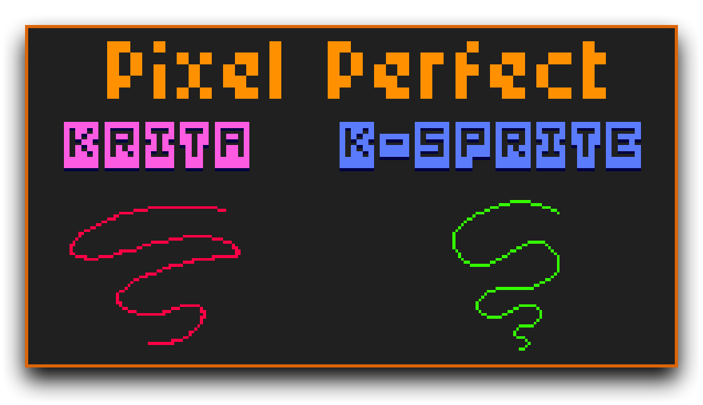

+++
title = 'SZK Krita Pixel Art Suite'
date = '2025-05-22T22:57:12+02:00'
description = "Krita plugin that adds lots of features for making Pixel Art!"
lastmod = '2025-05-22T22:57:12+02:00'
# draft = true # if true (or not set), the page will be excluded in build
private = false # If true, the article wont be listed and will only be visible by knowing its url
tags = ["krita","pixel art","k-sprite"]
# main_classes = 'pixel-font' # classes for <main> element. Allows customization of each page. Example of use: add a class from `fonts.scss` to change the page font. (consolas-font, handwritten-font, etc).
# # -------- DISPLAY OPTIONS --------
# accent_color = "#ff168a" # customize the color for links, etc in the page
accent_color = "#ff950a" # customize the color for links, etc in the page
# show_breadcrumbs = false
show_description = false
# show_author = false
# show_date = false
# show_reading_time = false
# show_tags = false
show_table_of_contents = true
show_right_bar = true
# show_next_and_previous_arrows = false # If false (or not set), will hide the left/right arrows next to the articles' title for navigating between articles
# show_related_articles = false # If false, it wont show the related articles at the bottom. If true (or non set), they will show.
# featured_image = 'szk-krita-pixel-art-suite.png' # local path for the image used as the cover. NOTE: Check its extension! (.png set as a template)
# NOTE Since this is a leaf bundle (page in its own folder), placing an image in the same folder with the name 'cover' (no matter its extension) will be used as the cover AUTOMATICALLY. BUT if 'featured_image' is set, it will use that (this is also useful for having different covers for each language, if that is needed).
# # ------- FEATURE OPTIONS --------
# featured = true # if true, the article will be featured in the index page.
# featured_title = 'Szk Krita Pixel Art Suite' # if set, it will use this as the title in the featured card. If not, it will use the article's title.
# featured_description = "" # if set, the article will use this description in the featured card. If not, it will use the article's description.
# featured_tags = [""] # if set, it will only feature the tags in this array (useful to display only some of the tags). Note: Tags must match the tag in .Params.tags
# related_pages = [""] # If set, these pages (up to 3) will be displayed in the related section for this page. Useful when you want to be sure that a page appears as related
+++

<!-- > Plugin for Krita that makes doing pixel  -->

<!-- > Plugin that makes doing **Pixel Art** in *Krita* **much better**! -->

> *Awesome* plugin for ****** that adds **** for making ****!



<!-- # Test table of contents -->



# Installation

<!--  -->

<!-- # **Installation** -->

1. Download the `.zip`.
2. In Krita, go to ***Tools ‣ Scripts ‣ Import Python Plugin…***, find the `.zip` file and press OK.
3. Restart Krita.
4. Go to ***Settings ➡ Dockers ➡ SZK Pixel Art Suite***

A new **docker** with the plugin will appear:



<!-- <figure>
&nbsp;<em>Different tabs of the docker</em>
</figure> -->

<!--  -->

## Tabs




<!-- 
 -->

    

    

    

    

    

    



# Color Shading

This is inspired by the color shading panel from [*Pyxel Edit*](https://pyxeledit.com/), which provided interesting color shadings very easily. 

It brings its original functionality to *Krita* and expands on it by **adding a few more options**.



It works by generating **color variations based on a color**. This base color is always <u>at the center of a palette</u> (except for the "mix" (mixer) palette).



> This section is inspired by the original shading system from Pyxel Edit. 

The **main shading palette** (on top), works by shifting the value, saturation and hue to an specific blue tone for the dark tones (on the left). For the brighter colors (on the right), works the same but shifting the colors to a brighter yellow hue.

 

 - Shifts (only) the **value/light**.

 

 - Shifts (only) the **saturation**.

 

 - Shifts (only) the **hue**.

 


**l**, **s** and **h** are very useful for fine-tuning your colors using the  [(See 'Swatches' section)](#swatches)






The shading palettes  and  are affected by the hues selected in the **sliders** above. The **left slider** controls the **hue** for the **shadows**, while the **right slider** controls the **hue** for the **bright colors**.

 



This **offers more control** for making cohesive color combinations under specific settings. 

> For example, lets say you are painting a sunset scene with an *orange* light source, and you want the shadows to gather around a pink. You can select both hues in the sliders and generate easily colors that look good in that setting.



>  uses the **same algorithm** as the one inspired by ***Pyxel Edit***. 
>  
>  
>  Uses a **different algorithm** (it usually gives more muddy colors for the shadows and more coloured lights).

---


Mixes 2 colors.


It uses an algorithm that **checks hor similar are both colors**, and reduces/adds more swatches depending how similar they are.

(The more different they are, the more steps/swatches it adds).

> You can still change the resolution/number of steps by changing the  next to the 



Press the  and  buttons to change the colors that are mixed.

Those buttons have the following shortcuts:

 

| Shortcut         | Action     
| :----------- | ------: | 
|  | Triggers the **color selector**
| | Triggers the **color picker** to grab any color
| | Picks the **Foreground color**
| | Picks the **background** color

 


I personally find the  very useful and fast, and is the main way I use the mixer.




**To generate a shading palette:**
- Press the  /  button to grab your current **foreground/background color** and build the shading palettes around it.
- Press the  on a swatch. [See 'Swatches' section below for more info](#swatches)

## Swatches

> A '*swatch*' is a single color sample of a gradient.

Mouse Button (MB) shortcuts/actions:
| Shortcut         | Action     
| :----------- | ------: | 
|  | Pick **foreground** color
| | Pick **background** color 
| | Pick **foreground** color <u>and **rebuild the palette**</u>

<!-- 
*\* MB = "Mouse Button"*
 -->


I personally find  very useful for *fine tuning* your base color by shifting its value, hue, saturation, etc. until you got a shading that you like 👌.


When you click a swatch, the color becomes active:



Once a color is selected, you can:

- Move easily forwards/backwards in the active shading palette with a shortcuts. ([See shortcuts section](#shortcuts))

- **Add** the whole shading to your **active palette**.

## Managing Palettes

The *Color Shading* tab is "connected" to the native Palette docker by ***Krita***.



Go to `Settings -> Dockers -> Palette` 



 

A docker like this will appear:

 





<!--  -->

### Add colors to palette

When you have a gradient selected (by having selected a swatch), you can add all its colors to the active palette. For that, press this button:



<!-- --- -->

<!--  -->

### Sort Palettes

It includes actions for adding and **sorting** colors in Krita's default Palette docker **by different criteria** (hue, value, saturation, perceived lightness, color similarity, etc.), similar to other softwares. 

> This is something I personally find **very useful when working with limited color palettes**.

To sort your active Palette, press the  button:



Most are self explanatory. Even though, some ones worthy to explain:

- **Perceived lightness**: This sorts the colors according how human eye perceives lightness. Is not always the same as the "value" sort.

- **Cielab similarity**: Sorts the colors of your palette according by **how similar** they are to your **active** (foreground) **color**.

<!-- 
**TIP**: When choosing a color from a palette row, you can use shortcuts to quickly select darker or lighter variations within the selected row of colors.
 -->

# Color Replace

Allows to precisely replace an specific color in the selected layers/groups or in the entire document.

This is useful when you want to change a palette or a certain color of an entire document or layer.


The color to be replaced has to match the **exact color** (there is no treshold margin).




 - **Color to be replaced** (left) and **new color** (right)



| Shortcut         | Action     
| :----------- | ------: | 
|  | Triggers the **color selector**
| | Triggers the **color picker** to grab any color
| | Picks the **Foreground color**
| | Picks the **background** color

 


 Just **hover** the mouse under the colors **to see a tooltip** with these **shortcuts**:







 - **Swap** replaced and new color.


**Note**: At the moment **undo/redo is not supported natively in Krita' scripts**, so if you want to **undo changes** you can **swap the colors** (with the swap button) and **re-execute the color replace**.


 - **Alpha** for the new color (in case you need to set a new one).

 - Replaces the color in the **selected layer(s)**.


You can select more than one layer.


 -  **Replaces the color in every layer** of the active document.

# Index Painting

Sets up an index painting group for a layer (or group) with a single click.





***Index Painting*** is a technique that **automatically dithers and reduce colors on a non-pixel art artwork**. 

> This means that <strong>{}</strong> , gradients, etc. for painting and still obtaining a Pixel Art aesthetic. 👌

Cool example of the aesthetic that is achievable with index painting:



If you are curious, you can [**learn more about this technique here.**](http://danfessler.com/blog/hd-index-painting-in-photoshop)


It comes with a pattern editor that allows to create, save and load different patterns-pressets for the dithering effect:

This is mostly to play, experiment and discover new and cool pixel gradient effects.



## Interface



-  **Matrix Size**: Increase/decrease the rows/columns of the dither matrix.

 

-  **Rotate**: Rotates the dither matrix.


 

-  **Invert**: Inverts the color in the dither matrix.


 

-  **Clear the matrix**: Resets all cells.


Press it **twice** to fill/clear all the cells.


-  **Dither Presets**: Change the dither preset.

-  **Save Preset**: Save your own dither preset for using it later.

-  **Delete Preset**: Deletes the **selected preset**.

-  **Dither Matrix**: Here you can paint/modify each cell of the dither matrix. Each cell represents a pixel of the dither pattern.



There is some different ways for painting the matrix:
Shortcut | Action
:-- | --:
 /  | Activate/deactivate cell (full painting)
 | Adds/Substracts a cell value in **quantized steps**.
 | **Smooth painting**.


**TIP**: Hover a cell (or any UI element) to see its tooltip with its information.


-  **Create Index Painting**: Press to generate an Index Painting folder for the selected layer/group.

-  **Repaint the dithering layer**: Updates the dither pattern. Useful to call it after drawing on the matrix.

The active layer must either be the "Dither" layer, or a sibling of the "Dither" layer.

Note: The dither layer must be named "Dither". This is due that after pressing the button, it searches if there is an Index Painting group set up with a dither layer.


-  **Create dither pattern layer**: Adds a dithering layer with the dithering pattern set on the matrix

This can be used as a **pattern generator** (useful for making **textures for brushes**, **gradients**, etc).


## Setting an Index Painting group

Having a **black and white** drawing (or an empty layer if you want to draw from scratch): 




Note: It is preferable if the drawing already has **crisp/hard edges**, since Index Painting tends to generate smooth soft edges in the silhouettes (which is not desirable for Pixel Art).


Press the button ***Index Painting***, in the Index Painting Tab:



It will result in something like:



It makes a group with everything needed for Index Painting. 

The **group** consists of:

- A **Gradient Map** / **Index Colors** filter layer, depending on your [*Index Painting Options*](#index-painting-options)

**Note**:  on this layer to open the **Properties** and edit the colors used for the shading. 

- **Dither**: This layer holds the dither pattern from the dither matrix.

Note: If you are using a Gradient Map, you can change its pattern in its settings (Right Click on the layer -> Properties). Having both patterns combines them and increases the dithering effect.

 
  
  TIP: **Increase/reduce** its **opacity** to **change** the **dithering** effect.
  

- **Gradient** (optional, depends on your [*Index Painting Options*](#index-painting-options)): It helps to visualize the effect and to sample colors.

Having the "*Gradient*" layer **selected**, you can **sample its black and white** colors with , and have an idea of the dither amount that value will have.


- [Your selected layer/group] (***B&W sphere*** in this example): 

# Export Tab

Allows exporting the document (or any selected layer(s)) scaled by a factor very easily and fast.



Useful when you want a higher resolution image of your Pixel Art drawing.



## Image settings

- **Scale**: Size multiplicator. 
- **Quality**: Image compression quality. The higher, the better quality (and the file size).
  > Since Pixel Art normally tends to have lots of contiguous pixels with the same value, a low value usually keeps enough quality.
- **Directory**: Suports both <u>**relative** and **absolute** directories</u>.
  - **relative** example: Setting a value of, lets say, `Exports/Version 1` will make the exported images to be in a subdirectory relative the current path of the active document.
    - Eg: if your document is placed in `C:\Users\Dexter\Desktop\my-awesome-pixel-art.kra`, the exported images will be in `C:\Users\Dexter\Desktop\Exports\Version 1`
  - **Absolute** example: Setting an absolute path (like, lets say: `C:\Users\Mike\Pictures\My Pixel Art`) will place all exported images in that folder, and **ignore the document's path**.
- **File name**: Add a custom name for the exported image.

Leaving it **<u>empty</u>** will add the **document's name**. 


- **Format**: Select your preferred image format. (Supports `.png`, `.jpg`, `.webp` and `.bmp`)

## Naming Options
- **Add scale**: If true (checked), it will add the scale factor to the file name.
- **Overwrite**: If false (unchecked), will add an unique time stamp for avoid overwriting files. 

This is useful if you want to manually save some "snapshots" of your drawing and don't want to overwrite the images.

  - If true (checked) the files with the same name will be overwritten.

---
- **Selection only** - If true/checked, it will only export the region selected. Useful if you want to export only an specific area/region.
- 📁 - Click to open the folder with the exported images.
- **Export Scaled** - Exports the whole document.
- **Export Selected** - Exports only the selected layer/layers/group
  - **Trim** - If true/checked, the exported layers will be cropped to their bounds. If false, their size will be the document size.

<!--    -->
This is useful, for example, for exporting different sprites for a game easily 🎮.


# K-Sprite

K-Sprite is a **Pixel Art editor inside Krita** that is meant to add all the Pixel Art **features** that are missing in Krita. Like a pixel perfect brush, or tools for propper ellipses/circles, bezier lines, pixelated text, etc.



> It’s not meant to fully replace the process of drawing Pixel Art in Krita (because Krita is still a great tool for that!). It’s meant to **add all those tools that I always missed** while doing Pixel Art, and to make **creating Pixel Art in Krita** 

## Tutorial

To execute **K-Sprite**, go to the `Pencil Tab ✏️` in the docker, or press the **shortcut** for `Open SZK K Pixel Art Editor (SZK Pixel Art Suite)` (Default ).

<!-- A new window will appear on top of Krita (`1`), and will grab the active layer (`2`): -->
A new **window will appear** on top of Krita , and will **grab the active layer** :

<!-- > `1` - The window will render on top always so you can still use other krita dockers/plugins while drawing in *K-Sprite*  
> &gt; `2` - The active layer will be temporarily hidden in Krita's UI. This is due *K-Sprite* renders the document, and having it visible will make it impossible to see changes in case you erase parts of the active layer inside *K-Sprite* -->
> - **The window will render on top** always so you can **still use other krita dockers**/plugins while drawing in *K-Sprite*.
>
> - **The active layer will be temporarily hidden in Krita's UI**. This is due *K-Sprite* renders the document, and having it visible will make it impossible to see changes in case you erase parts of the active layer inside *K-Sprite*


You will be able to **draw** in the **layer you had selected when you executed K-Sprite**.

This layer **will appear on top**, while the rest of the document will be in the background:




Once you submit the changes, it will appear as usual in Krita, in its correct layer position.




## Interface



<!-- <figure>

</figure> -->

- : Options related the selected tool.
- : Diferent actions, like undo/redo, solo mode, etc.
- : Contains all the drawing **tools**.
- : This is where you draw.
- : Buttons for submitting your changes to Krita.
- : Offers different information about the selected tool, the hovering elements, etc.


### Tool Options {.no-display}

Options for the different drawing tools.


These options appear/disappear depending on the active tool.




Option | | Shortcut
:--|:--|--:
 Pixel Perfect | Makes perfect pixel lines. | 
 Erase Mode |  | 
 Dither Mode | Use the  as a pattern when drawing.| 
 Fill Mode | Fill a primitive with color. | 
 X/Y Mirror |  |  / 


### Actions {.no-display}



Button | | Shortcut
:--|:--|--:
 Solo Mode | Display only the layer that is being edited. | 
 Adjust document to view |  | 
 Delete All | Clear all the content in the edited layer.| (No shortcut)
 Undo/Redo | Undo and redo changes. |  / 








### Tools {.no-display}
<!-- ### Tools {.no-display .underline} -->





<!-- 
 -->

    

    

    

    

<!--  - Squares   

 - Circles    -->

    

    

    

    



<!-- <figure>

</figure> -->

<!-- #### Brush -->



<!-- #### Cepiiiii {.toc-only} -->

<!-- : **1px brush** with <u>**pixel perfect**</u> option. -->
**1px brush** with <u>**pixel perfect**</u> option for **clean pixel art strokes**.
**Shortcut**: 

<!--  -->



Drawing Shortcuts | Action
:--|--:
 | Paint with Foreground (FG) color.
 | Paint with Background (BG) color.
 (Hold) | Make a line between from the last point to the cursor.
 (Hold) | Pick FG/BG color.

<!-- <figure>

</figure> -->

<!-- : Automatically calculates the color of a pixel by their neighbour pixels. -->



Brush for helping doing antialiasing. 
**Shortcut**: 



This calculated color is a "**bridge color**" between the current pixel, and its surrounding neighbours, for achieving that antialiasing effect. [If you don't know about Pixel Art antialiasing, or want to know more, check this awesome article.](https://saint11.art/pixel_art_articles/article5/).

<!-- ❗❗❗❗❗❗❗❗❗❗❗ -->
<!-- ❗❗❗❗❗❗❗❗❗❗❗ -->
<!-- ❗❗❗❗❗❗❗❗❗❗❗ -->
<!-- ❗❗❗❗❗❗❗❗❗❗❗ -->
<!-- TODO DECOMENTAR ESTO CUANDO SUBA LA ACTUALIZACION DEL ANTIALIASING!! -->
<!-- TODO DECOMENTAR ESTO CUANDO SUBA LA ACTUALIZACION DEL ANTIALIASING!! -->
<!-- TODO DECOMENTAR ESTO CUANDO SUBA LA ACTUALIZACION DEL ANTIALIASING!! -->
<!-- It offers 2 different algorithms for calculating that antialiasing color:



-  - Selects a color by **mixing** the current pixel and its neighbours.
-  - Selects the color in the **palette** that is most similar to the painted pixel and its neighbours, while being different (without repeating the current color or the color of its neighbors).

> This is  if you are strictly using a palette, and <u>want to use **only** colors that belong to that palette</u>.

The numbers (*P4, P8, M4, M8*) reffers to the **total neighbours** of a pixel that are **considered** in the algorithm:



-  - Takes in consideration 4 neighbours of a pixel.
-  - Takes in consideration all the neighbours of a pixel. -->

<!-- <figure>

</figure> -->



Tool for creating lines. 
**Shortcut**: 

<!-- : Makes a **straight line**. Press  to **snap** the line into perfect ratio lines. -->

<!-- Lo pongo open, porque es una FEATURE... hay que mostrar las cosas buenas SIN MIEDO -->


> I've added ** snapping angles** for making **perfect lines** than what is usual in most Pixel Art editors:

 

<!--  -->


 

This is due I personally like to draw perspective buildings, streets, etc. and I've always missed that some editors do not offer more snapping angles for doing some lines more easier.


<!-- : -->


Pixel Perfect **cubic and quadratic bezier** curves!
**Shortcut**: 



To make a Bezier Curve:

1. **Click and drag** to define start and end points on mouse click and mouse release.
2. **Place the first control** point by clicking a second time.
3. **Place the second control** point by clicking one last time.


For making a **cubic bezier**, simply click twice in the same position after adding the first control point and finish the curve.

(This is for adding the second control point in the same coordinates as the first one).




**TIP**: If you want the curve to still update even when the cursor is out of the editor, press (inside the editor) and drag wherever you need to make your curve.



This is due the points are added on **mouse release**, and if the window loses focus without an event pending (such as holding a mouse button), the editor can't be updated.




<!-- : Create squares  -->

<!-- : Improved circles -->



Tool for drawing Squares and Circles.

**Shortcuts**: 
- Rectangles:  
- Circles: 

<!-- 
Circles have been **improved**
 -->



<!-- <figure>

</figure> -->

Shortcuts | Action
:--|--:
 | Make **1:1** Squares/Circles.
 | Make **origin at center**.
 | **Move** Square/Circle.



Tool for filling closed areas.
**Shortcut**: 





The fill-bucket uses a <u>recursive algorithm</u> ([The *flood fill* algorithm](https://en.wikipedia.org/wiki/Flood_fill)), and **Krita has limited the amount of recursive calls a script can execute**, and this -sadly- cannot be changed.

This means that if the area to fill is ***big enough*** to reach that recursive calls limit, Krita will end that process and the fill won't be completed and show this window:




I tried some non-recursive algorithms, but they are generally way slower than the *Flood Fill algorithm*, so it is best to use Krita's fill-bucket tool for filling large areas. 

I considered removing the tool, but since it still does the job well for small and medium areas, I decided to keep it, since sometimes is useful 👍.







<!-- 2. **Text**: Tool to render correctly pixelated fonts -->

Tool for drawing pixel perfect fonts!
**Shortcut**: 

To add a text:
-  to **create a rectangle that contains the text**, or simply  to create a default area.
- Add and edit your text in the pop-up window:



Text editor window
:-- 
 Text input for adding your **text**.
 **Font** selector.
 Font **size**.
 Horizontal and Vertical **alignment**.
 **Fits the rectangle to the text** (useful if you need to recalculate the area in case the text is out of bounds).
 Crispness treshold. This is useful for adjust non|pixel art fonts and to make them look better.
 Color outline.
 Outline direction. Click one to toggle it on/of.
 Clear/Check all outline directions.

Press  to submit the text, or  to -- .


You can move the text while is being edited by  and dragging it:





**TIP**: It also  




<!-- <figure>

</figure> -->


<!-- Tool for zooming specific areas precissely. -->
Tool for precisely zooming in on specific areas.
**Shortcut**: 



Zoom Shortcuts | Action
:--|--:
 | Zoom in rectangle.
 | Zoom In.
 | Zoom Out.


### Canvas {.no-display}

<!-- Here is where you draw. It will render the current state of the document, and you will be editing the active layer that was active when launching the editor. -->

Here is where you draw. This area displays the current state of the document, and you will be editing **the layer that was active when you launched the editor**.

- Controls
Shortcut | Action
:-- | --:
 | **Paint** with **Foreground** Color (FG)
 | **Paint** with **Background** Color (BG)
 or  | **Pan Canvas**
 | **Zoom** in/out
 | **Sample** Foreground/Background color
 | **Switch** FG/BG Colors
 | (Zoom) **1:1 pixel scale**
 | (Zoom) **Fit** minimum width/height
 | (Zoom) **Fit document** into viewport


**TIP**: You can **mask regions** for painting in K-Sprite by **making a selection in Krita**:
<!-- <figure>

</figure> -->


This way, you will only be able to draw within the selection.


At the moment, there is no visual input inside K-Sprite to know if there is a selection active. You will have to look Krita's canvas for that.




### Export Buttons {.no-display}



Export the drawing/changes in K-Sprite to a `New Layer` or to the `Active Layer` in Krita

- `New layer` will export the drawing to a new layer **above the selected layer**.
- `Active layer` will export the drawing to the **layer that was active when executing the editor**.

> 
> 👉 These buttons may show or not **depending on the active layer** when launching the editor.
> 
>- Launching it with an **empty layer** will make <u>**not**</u> show the `New Layer` button (to avoid cluttering).
>- Launching it with a **hidden layer** selected will make <u>**not**</u> show the `Active Layer` button (this is to avoid committing changes to an invisible layer by mistake).


### Info Bar {.no-display}

Displays information, shortcuts, tips, etc. when **hovering** a button/tool.




This is useful for not having to remember every single shortcut, tip, etc.


# Options 

## Index Painting Options

- **Add gradient**: Adds a gradient to preview the dither and to sample colors.

  
  <!--   -->
  <!-- 
  Adding a gradient is useful to preview the dithering aesthetic if you don't have already a drawn layer.
   -->

    - **Position**: Changes the position of the gradient (*top, bottom, left, right*).
    - **Size**: The size of the gradient as a **percentage** of the document's size.
    - **Invert**: Inverts the gradient.
- **Method**
    - **Index colors**: Uses an index color filter
    - **Gradient map**: Uses a gradient map filter. You can configure its dither pattern in its properties.
  
  I personally preffer the **Gradient Map** option. Since is easier to manage colors.
  
- **Dither live preview**: When selecting a new pattern preset or editing the dither matrix (by rotating, inverting it, etc), if there is a "Dither" layer selected (or a sibling) of the selected layer, **the Dither layer will be updated automatically**.
  
  This is for being able to directly see how changes affect the shading dithering.

  
  

## Shortcuts


Go to `Settings -> Configure Krita`. There, click the `Keyboard Shortcuts` tab. 

Search for `SZK Pixel Art Suite` to see the available shortcuts.


Shortcuts provided by the plugin:

### Palette

- When selecting a color from a palette in the Shading tab, you can move backward/forward the active palette color with the shortcuts:
|Command | Default Shortcut
|:---|---:
Previous Palette Color (SZK Pixel Art Suite) | 
Next Palette Color (SZK Pixel Art Suite) | 

### K-Sprite

- You can execute the editor with the shortcut:
|Command | Default Shortcut
|:---|---:
Open SZK K Pixel Art Editor (SZK Pixel Art Suite) | 


I personally highly recommend to configure this to your choice. I personally like to trigger the editor as if I was changing of brush (for using one of its features, like the pixel perfect brush, or drawing a primitive, etc.)


### Export Pixel Art

- You can bind to a shortcut the action to export your pixel art with your current settings with:
|Command | Default Shortcut
|:---|---:
Export Scaled Pixel Art (Full Document) (SZK Pixel Art Suite) | (Not set)
Export Scaled Pixel Art (Selected Layers) (SZK Pixel Art Suite) | (Not set)

# Credits

**Fonts** used:

- [Minimal4](https://saint11.org/blog/fonts/) by *[Pedro Medeiros](https://saint11.art/)* ([@saint11](https://x.com/saint11)) ()
- [Tiny5-Regular](https://fonts.google.com/specimen/Tiny5) by *[Stefan Schmidt](https://fonts.google.com/?query=Stefan%20Schmidt)* ()

Mentioned **articles**:

- [HD Index Painting in Photoshop](http://danfessler.com/blog/hd-index-painting-in-photoshop) by [Dan Fessler](http://danfessler.com/).

- [Anti-Alias and Banding](https://saint11.art/pixel_art_articles/article5/) by [Pedro Medeiros](https://saint11.art/about/)

---



> I hope it helps  to  ** ** 🍀